# 🏗️ Architecture Overview

## Table of Contents

- [System Architecture](#system-architecture)
- [Component Relationships](#component-relationships)
- [Workflow Patterns](#workflow-patterns)
- [File Structure](#file-structure)
- [Data Flow](#data-flow)
- [Design Principles](#design-principles)

---

## System Architecture

### High-Level Overview

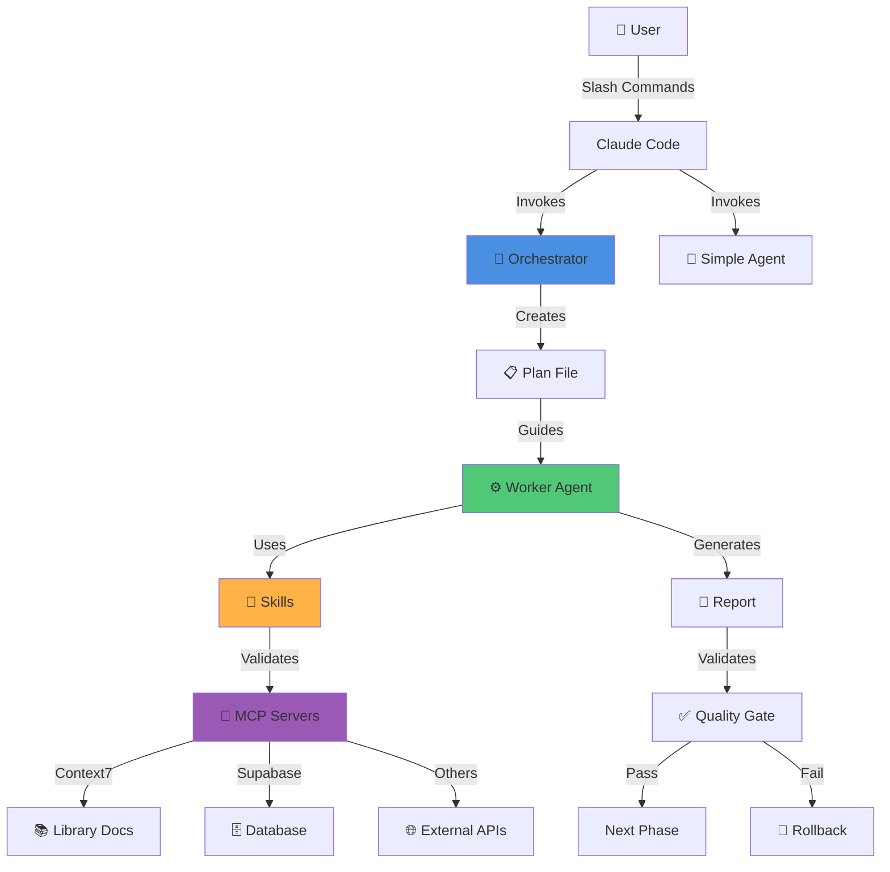
```mermaid
graph TB
    User[👤 User] -->|Slash Commands| Claude[Claude Code]
    Claude -->|Invokes| Orchestrator[🎼 Orchestrator]
    Claude -->|Invokes| SimpleAgent[🤖 Simple Agent]

    Orchestrator -->|Creates| Plan[📋 Plan File]
    Plan -->|Guides| Worker[⚙️ Worker Agent]
    Worker -->|Uses| Skills[🎯 Skills]
    Worker -->|Generates| Report[📄 Report]

    Report -->|Validates| QualityGate[✅ Quality Gate]
    QualityGate -->|Pass| NextPhase[Next Phase]
    QualityGate -->|Fail| Rollback[🔄 Rollback]

    Skills -->|Validates| MCP[🔌 MCP Servers]
    MCP -->|Context7| LibDocs[📚 Library Docs]
    MCP -->|Supabase| Database[🗄️ Database]
    MCP -->|Others| ExternalAPI[🌐 External APIs]

    style Orchestrator fill:#4A90E2
    style Worker fill:#50C878
    style Skills fill:#FFB347
    style MCP fill:#9B59B6
```

---

## Component Relationships

### Agent Ecosystem

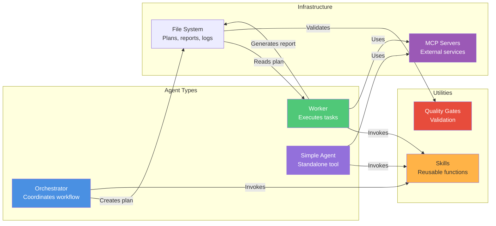
```mermaid
graph LR
    subgraph "Agent Types"
        O[Orchestrator<br/>Coordinates workflow]
        W[Worker<br/>Executes tasks]
        S[Simple Agent<br/>Standalone tool]
    end

    subgraph "Utilities"
        SK[Skills<br/>Reusable functions]
        QG[Quality Gates<br/>Validation]
    end

    subgraph "Infrastructure"
        MCP[MCP Servers<br/>External services]
        FS[File System<br/>Plans, reports, logs]
    end

    O -->|Creates plan| FS
    FS -->|Reads plan| W
    W -->|Generates report| FS
    FS -->|Validates| QG

    W -->|Invokes| SK
    O -->|Invokes| SK
    S -->|Invokes| SK

    W -->|Uses| MCP
    S -->|Uses| MCP

    style O fill:#4A90E2,color:#fff
    style W fill:#50C878,color:#fff
    style S fill:#9370DB,color:#fff
    style SK fill:#FFB347
    style QG fill:#E74C3C,color:#fff
    style MCP fill:#9B59B6,color:#fff
```

### Category Hierarchy

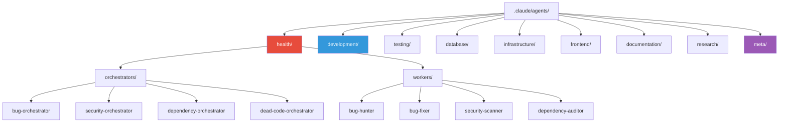
```mermaid
graph TD
    Root[.claude/agents/] --> Health[health/]
    Root --> Development[development/]
    Root --> Testing[testing/]
    Root --> Database[database/]
    Root --> Infrastructure[infrastructure/]
    Root --> Frontend[frontend/]
    Root --> Documentation[documentation/]
    Root --> Research[research/]
    Root --> Meta[meta/]

    Health --> HO[orchestrators/]
    Health --> HW[workers/]

    HO --> BO[bug-orchestrator]
    HO --> SO[security-orchestrator]
    HO --> DO[dependency-orchestrator]
    HO --> DCO[dead-code-orchestrator]

    HW --> BH[bug-hunter]
    HW --> BF[bug-fixer]
    HW --> SS[security-scanner]
    HW --> DA[dependency-auditor]

    style Health fill:#E74C3C,color:#fff
    style Development fill:#3498DB,color:#fff
    style Meta fill:#9B59B6,color:#fff
```

---

## Workflow Patterns

### 1. Return Control Pattern (PD-1)

**The Core Pattern** preventing context nesting:

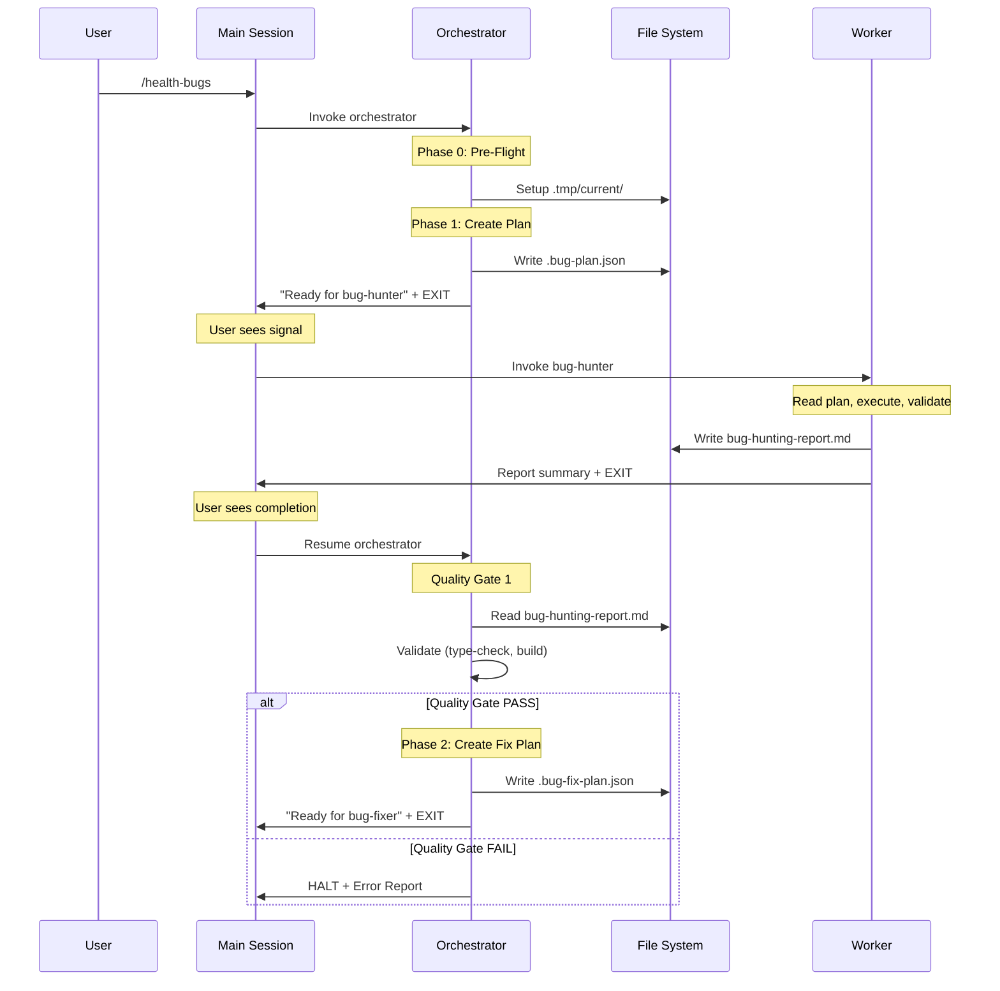
```mermaid
sequenceDiagram
    participant User
    participant Main as Main Session
    participant Orch as Orchestrator
    participant FS as File System
    participant Worker

    User->>Main: /health-bugs
    Main->>Orch: Invoke orchestrator

    Note over Orch: Phase 0: Pre-Flight
    Orch->>FS: Setup .tmp/current/

    Note over Orch: Phase 1: Create Plan
    Orch->>FS: Write .bug-plan.json
    Orch->>Main: "Ready for bug-hunter" + EXIT

    Note over Main: User sees signal
    Main->>Worker: Invoke bug-hunter

    Note over Worker: Read plan, execute, validate
    Worker->>FS: Write bug-hunting-report.md
    Worker->>Main: Report summary + EXIT

    Note over Main: User sees completion
    Main->>Orch: Resume orchestrator

    Note over Orch: Quality Gate 1
    Orch->>FS: Read bug-hunting-report.md
    Orch->>Orch: Validate (type-check, build)

    alt Quality Gate PASS
        Note over Orch: Phase 2: Create Fix Plan
        Orch->>FS: Write .bug-fix-plan.json
        Orch->>Main: "Ready for bug-fixer" + EXIT
    else Quality Gate FAIL
        Orch->>Main: HALT + Error Report
    end
```

**Why Return Control?**
- ✅ Prevents context nesting (worker context stays isolated)
- ✅ Enables rollback (clear separation of phases)
- ✅ Prevents infinite loops (main session controls invocations)
- ✅ User visibility (sees each phase completion)

---

### 2. Quality Gate Pattern

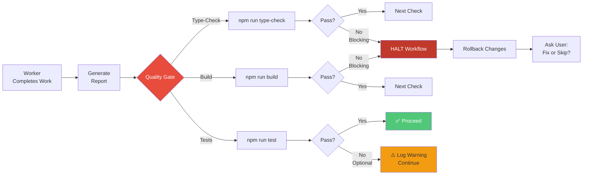
```mermaid
graph LR
    Start[Worker<br/>Completes Work] --> Report[Generate<br/>Report]
    Report --> QG{Quality Gate}

    QG -->|Type-Check| TC[npm run type-check]
    QG -->|Build| B[npm run build]
    QG -->|Tests| T[npm run test]

    TC --> TCR{Pass?}
    B --> BR{Pass?}
    T --> TR{Pass?}

    TCR -->|Yes| Check2[Next Check]
    TCR -->|No<br/>Blocking| Fail[HALT Workflow]

    BR -->|Yes| Check3[Next Check]
    BR -->|No<br/>Blocking| Fail

    TR -->|Yes| Success[✅ Proceed]
    TR -->|No<br/>Optional| Warning[⚠️ Log Warning<br/>Continue]

    Fail --> Rollback[Rollback Changes]
    Rollback --> UserPrompt[Ask User:<br/>Fix or Skip?]

    style QG fill:#E74C3C,color:#fff
    style Success fill:#50C878,color:#fff
    style Fail fill:#C0392B,color:#fff
    style Warning fill:#F39C12
```

**Quality Gate Configuration** in plan files:

```json
{
  "validation": {
    "required": ["type-check", "build"],
    "optional": ["tests", "lint"]
  }
}
```

---

### 3. Iterative Workflow Pattern

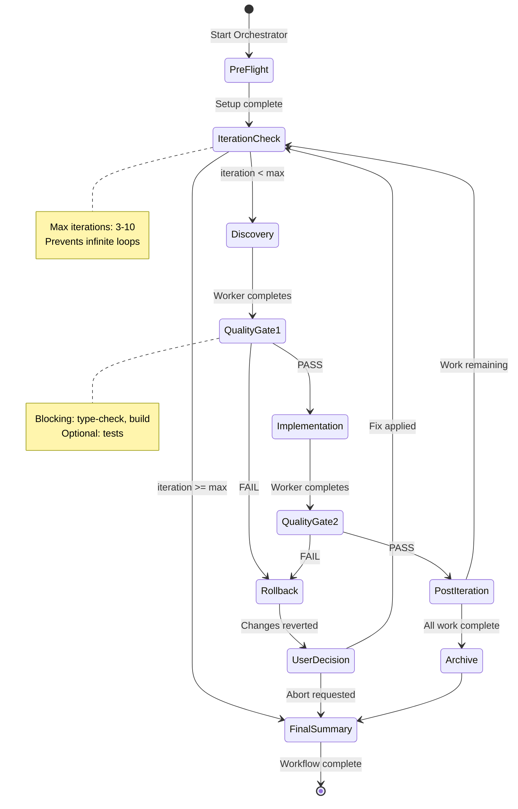
```mermaid
stateDiagram-v2
    [*] --> PreFlight: Start Orchestrator

    PreFlight --> IterationCheck: Setup complete

    IterationCheck --> Discovery: iteration < max
    IterationCheck --> FinalSummary: iteration >= max

    Discovery --> QualityGate1: Worker completes
    QualityGate1 --> Implementation: PASS
    QualityGate1 --> Rollback: FAIL

    Implementation --> QualityGate2: Worker completes
    QualityGate2 --> PostIteration: PASS
    QualityGate2 --> Rollback: FAIL

    PostIteration --> Archive: All work complete
    PostIteration --> IterationCheck: Work remaining

    Rollback --> UserDecision: Changes reverted
    UserDecision --> IterationCheck: Fix applied
    UserDecision --> FinalSummary: Abort requested

    Archive --> FinalSummary
    FinalSummary --> [*]: Workflow complete

    note right of IterationCheck
        Max iterations: 3-10
        Prevents infinite loops
    end note

    note right of QualityGate1
        Blocking: type-check, build
        Optional: tests
    end note
```

**Example**: bug-orchestrator runs up to 3 iterations:
1. Iteration 1: Find bugs → Fix critical/high
2. Iteration 2: Verification scan → Fix remaining
3. Iteration 3: Final check → Report

---

## File Structure

### Directory Layout

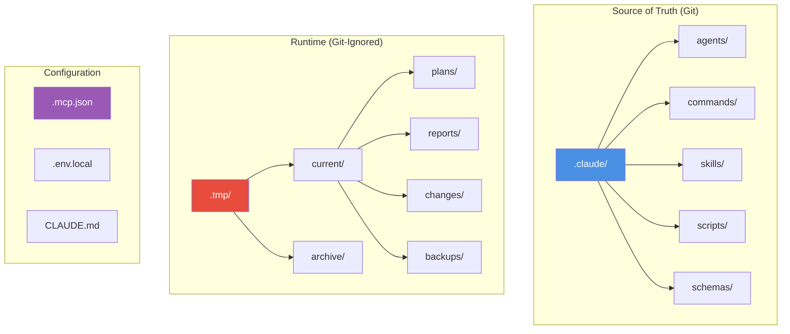
```mermaid
graph TB
    subgraph "Source of Truth (Git)"
        Claude[.claude/]
        Agents[agents/]
        Commands[commands/]
        Skills[skills/]
        Scripts[scripts/]
        Schemas[schemas/]
    end

    subgraph "Runtime (Git-Ignored)"
        Tmp[.tmp/]
        Current[current/]
        Plans[plans/]
        Reports[reports/]
        Changes[changes/]
        Backups[backups/]
        Archive[archive/]
    end

    subgraph "Configuration"
        MCP[.mcp.json]
        Env[.env.local]
        BehavioralOS[CLAUDE.md]
    end

    Claude --> Agents
    Claude --> Commands
    Claude --> Skills
    Claude --> Scripts
    Claude --> Schemas

    Tmp --> Current
    Tmp --> Archive
    Current --> Plans
    Current --> Reports
    Current --> Changes
    Current --> Backups

    style Claude fill:#4A90E2,color:#fff
    style Tmp fill:#E74C3C,color:#fff
    style MCP fill:#9B59B6,color:#fff
```

### File Flow During Workflow

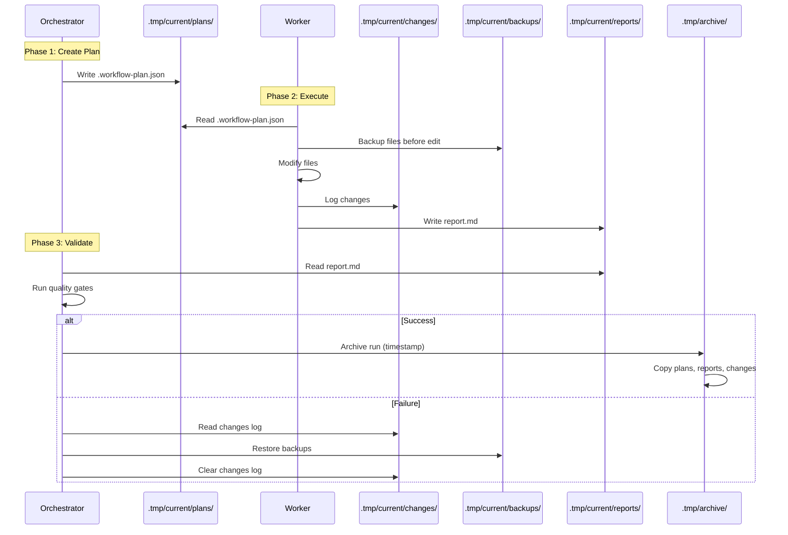
```mermaid
sequenceDiagram
    participant O as Orchestrator
    participant P as .tmp/current/plans/
    participant W as Worker
    participant C as .tmp/current/changes/
    participant B as .tmp/current/backups/
    participant R as .tmp/current/reports/
    participant A as .tmp/archive/

    Note over O: Phase 1: Create Plan
    O->>P: Write .workflow-plan.json

    Note over W: Phase 2: Execute
    W->>P: Read .workflow-plan.json
    W->>B: Backup files before edit
    W->>W: Modify files
    W->>C: Log changes
    W->>R: Write report.md

    Note over O: Phase 3: Validate
    O->>R: Read report.md
    O->>O: Run quality gates

    alt Success
        O->>A: Archive run (timestamp)
        A->>A: Copy plans, reports, changes
    else Failure
        O->>C: Read changes log
        O->>B: Restore backups
        O->>C: Clear changes log
    end
```

---

## Data Flow

### Plan File → Worker → Report

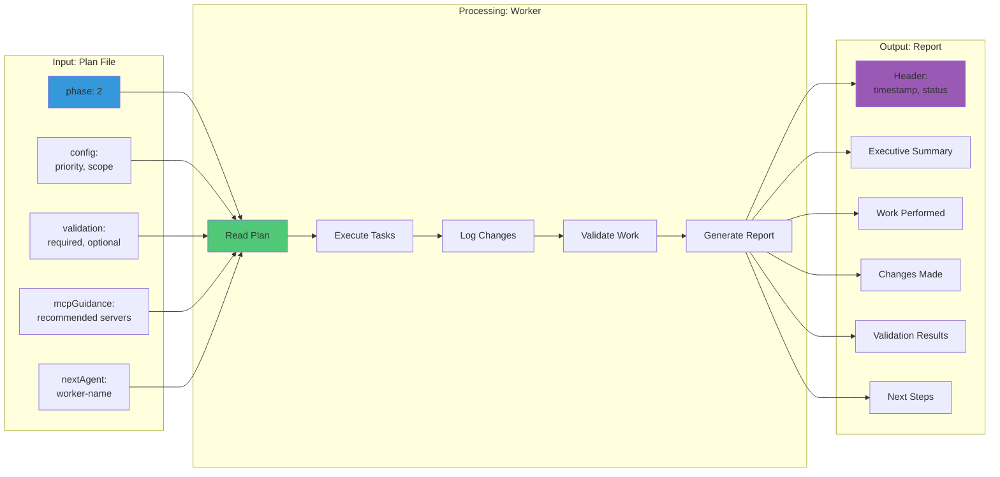
```mermaid
graph LR
    subgraph "Input: Plan File"
        P1[phase: 2]
        P2[config:<br/>priority, scope]
        P3[validation:<br/>required, optional]
        P4[mcpGuidance:<br/>recommended servers]
        P5[nextAgent:<br/>worker-name]
    end

    subgraph "Processing: Worker"
        W1[Read Plan]
        W2[Execute Tasks]
        W3[Log Changes]
        W4[Validate Work]
        W5[Generate Report]
    end

    subgraph "Output: Report"
        R1[Header:<br/>timestamp, status]
        R2[Executive Summary]
        R3[Work Performed]
        R4[Changes Made]
        R5[Validation Results]
        R6[Next Steps]
    end

    P1 & P2 & P3 & P4 & P5 --> W1
    W1 --> W2
    W2 --> W3
    W3 --> W4
    W4 --> W5
    W5 --> R1 & R2 & R3 & R4 & R5 & R6

    style P1 fill:#3498DB
    style W1 fill:#50C878
    style R1 fill:#9B59B6
```

### MCP Server Integration

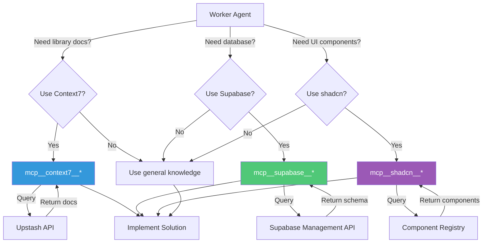
```mermaid
graph TB
    Worker[Worker Agent] -->|Need library docs?| Context7Decision{Use Context7?}
    Worker -->|Need database?| SupabaseDecision{Use Supabase?}
    Worker -->|Need UI components?| ShadcnDecision{Use shadcn?}

    Context7Decision -->|Yes| Context7[mcp__context7__*]
    Context7Decision -->|No| DirectCode[Use general knowledge]

    SupabaseDecision -->|Yes| Supabase[mcp__supabase__*]
    SupabaseDecision -->|No| DirectCode

    ShadcnDecision -->|Yes| Shadcn[mcp__shadcn__*]
    ShadcnDecision -->|No| DirectCode

    Context7 -->|Query| Upstash[Upstash API]
    Supabase -->|Query| SupabaseAPI[Supabase Management API]
    Shadcn -->|Query| Registry[Component Registry]

    Upstash -->|Return docs| Context7
    SupabaseAPI -->|Return schema| Supabase
    Registry -->|Return components| Shadcn

    Context7 & Supabase & Shadcn & DirectCode --> Implementation[Implement Solution]

    style Context7 fill:#3498DB,color:#fff
    style Supabase fill:#50C878,color:#fff
    style Shadcn fill:#9B59B6,color:#fff
```

---

## Design Principles

### 1. Single Responsibility

**Each component has one clear purpose:**

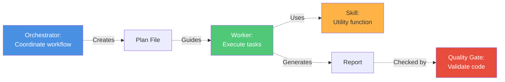
```mermaid
graph LR
    O[Orchestrator:<br/>Coordinate workflow]
    W[Worker:<br/>Execute tasks]
    S[Skill:<br/>Utility function]
    Q[Quality Gate:<br/>Validate code]

    O -.->|Creates| Plan[Plan File]
    Plan -.->|Guides| W
    W -.->|Uses| S
    W -.->|Generates| Report[Report]
    Report -.->|Checked by| Q

    style O fill:#4A90E2,color:#fff
    style W fill:#50C878,color:#fff
    style S fill:#FFB347
    style Q fill:#E74C3C,color:#fff
```

**Anti-pattern**: Orchestrator doing implementation work (violates SRP)

---

### 2. Separation of Concerns

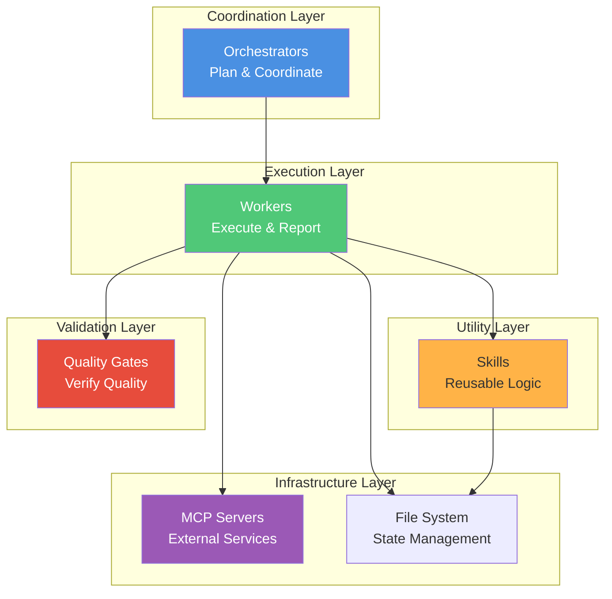
```mermaid
graph TB
    subgraph "Coordination Layer"
        Orchestrator[Orchestrators<br/>Plan & Coordinate]
    end

    subgraph "Execution Layer"
        Workers[Workers<br/>Execute & Report]
    end

    subgraph "Utility Layer"
        Skills[Skills<br/>Reusable Logic]
    end

    subgraph "Validation Layer"
        Gates[Quality Gates<br/>Verify Quality]
    end

    subgraph "Infrastructure Layer"
        MCP[MCP Servers<br/>External Services]
        FS[File System<br/>State Management]
    end

    Orchestrator --> Workers
    Workers --> Skills
    Workers --> Gates
    Workers --> MCP
    Workers --> FS
    Skills --> FS

    style Orchestrator fill:#4A90E2,color:#fff
    style Workers fill:#50C878,color:#fff
    style Skills fill:#FFB347
    style Gates fill:#E74C3C,color:#fff
    style MCP fill:#9B59B6,color:#fff
```

---

### 3. Fail-Fast with Rollback

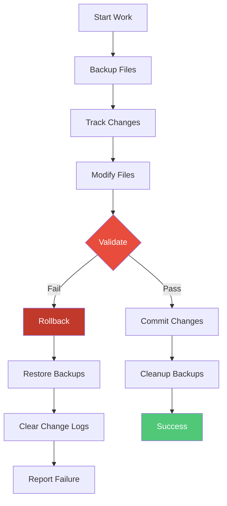
```mermaid
graph TD
    Start[Start Work] --> Backup[Backup Files]
    Backup --> Changes[Track Changes]
    Changes --> Work[Modify Files]
    Work --> Validate{Validate}

    Validate -->|Pass| Commit[Commit Changes]
    Validate -->|Fail| Rollback[Rollback]

    Rollback --> RestoreBackups[Restore Backups]
    RestoreBackups --> ClearLogs[Clear Change Logs]
    ClearLogs --> Report[Report Failure]

    Commit --> CleanupBackups[Cleanup Backups]
    CleanupBackups --> Success[Success]

    style Validate fill:#E74C3C,color:#fff
    style Rollback fill:#C0392B,color:#fff
    style Success fill:#50C878,color:#fff
```

**Implementation**:
- All changes logged to `.tmp/current/changes/*.json`
- Original files backed up to `.tmp/current/backups/`
- `rollback-changes` skill reverses all modifications

---

### 4. Observable Workflows

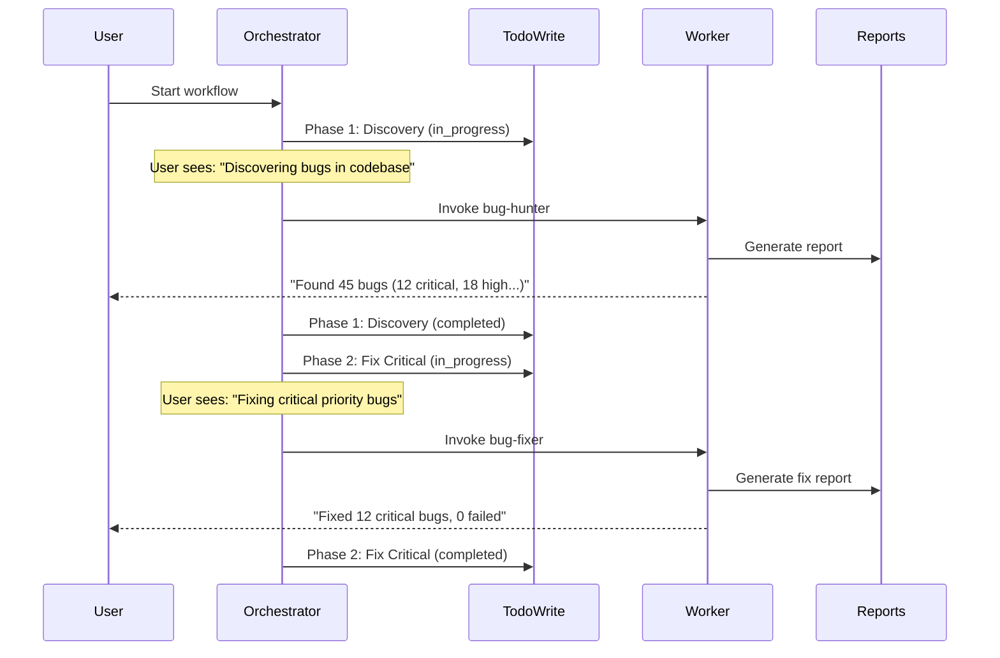
```mermaid
sequenceDiagram
    participant User
    participant Orch as Orchestrator
    participant TODO as TodoWrite
    participant Worker
    participant Report as Reports

    User->>Orch: Start workflow

    Orch->>TODO: Phase 1: Discovery (in_progress)
    Note over Orch: User sees: "Discovering bugs in codebase"

    Orch->>Worker: Invoke bug-hunter
    Worker->>Report: Generate report
    Worker-->>User: "Found 45 bugs (12 critical, 18 high...)"

    Orch->>TODO: Phase 1: Discovery (completed)
    Orch->>TODO: Phase 2: Fix Critical (in_progress)
    Note over Orch: User sees: "Fixing critical priority bugs"

    Orch->>Worker: Invoke bug-fixer
    Worker->>Report: Generate fix report
    Worker-->>User: "Fixed 12 critical bugs, 0 failed"

    Orch->>TODO: Phase 2: Fix Critical (completed)
```

**Observability features**:
- TodoWrite updates (real-time progress)
- Phase-by-phase execution (clear stages)
- Detailed reports (audit trail)
- User prompts at critical decisions

---

### 5. Graceful Degradation

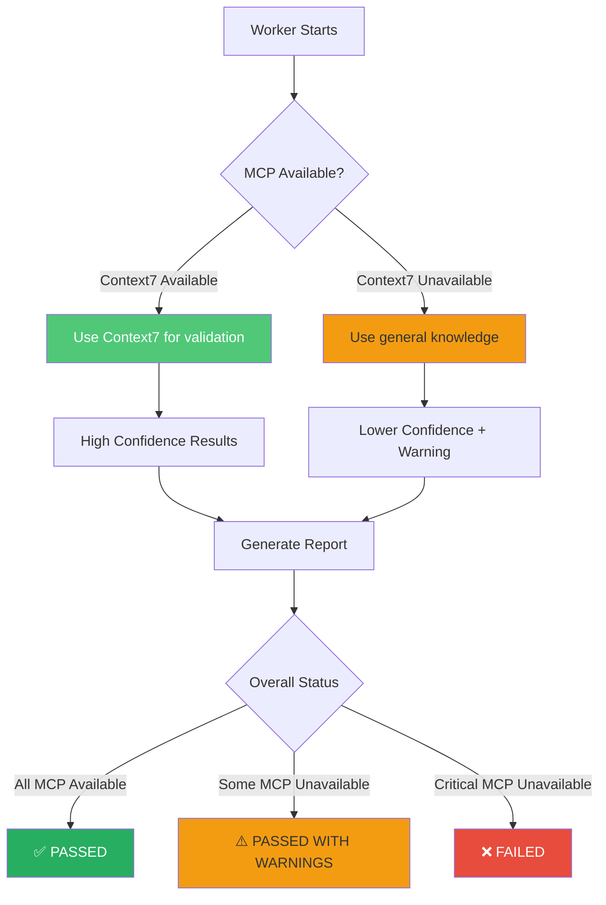
```mermaid
graph TD
    Start[Worker Starts] --> CheckMCP{MCP Available?}

    CheckMCP -->|Context7 Available| UseContext7[Use Context7 for validation]
    CheckMCP -->|Context7 Unavailable| Fallback[Use general knowledge]

    UseContext7 --> HighConfidence[High Confidence Results]
    Fallback --> LowerConfidence[Lower Confidence + Warning]

    HighConfidence --> Report[Generate Report]
    LowerConfidence --> Report

    Report --> Status{Overall Status}
    Status -->|All MCP Available| FullSuccess[✅ PASSED]
    Status -->|Some MCP Unavailable| PartialSuccess[⚠️ PASSED WITH WARNINGS]
    Status -->|Critical MCP Unavailable| Failure[❌ FAILED]

    style UseContext7 fill:#50C878,color:#fff
    style Fallback fill:#F39C12
    style FullSuccess fill:#27AE60,color:#fff
    style PartialSuccess fill:#F39C12
    style Failure fill:#E74C3C,color:#fff
```

**Fallback strategy**:
- Context7 unavailable → Use general knowledge + reduce confidence
- Quality gate fails → Prompt user (fix/skip/abort)
- Max iterations → Generate summary with partial results
- Token budget exhausted → Simplified mode → Emergency exit

---

## MCP Configuration Architecture

### Configuration Tiers

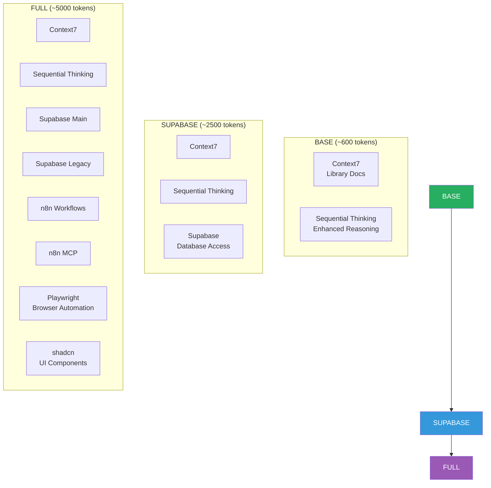
```mermaid
graph TB
    subgraph "BASE (~600 tokens)"
        B1[Context7<br/>Library Docs]
        B2[Sequential Thinking<br/>Enhanced Reasoning]
    end

    subgraph "SUPABASE (~2500 tokens)"
        S1[Context7]
        S2[Sequential Thinking]
        S3[Supabase<br/>Database Access]
    end

    subgraph "FULL (~5000 tokens)"
        F1[Context7]
        F2[Sequential Thinking]
        F3[Supabase Main]
        F4[Supabase Legacy]
        F5[n8n Workflows]
        F6[n8n MCP]
        F7[Playwright<br/>Browser Automation]
        F8[shadcn<br/>UI Components]
    end

    BASE --> SUPABASE
    SUPABASE --> FULL

    style BASE fill:#27AE60,color:#fff
    style SUPABASE fill:#3498DB,color:#fff
    style FULL fill:#9B59B6,color:#fff
```

### Configuration Selection Decision Tree

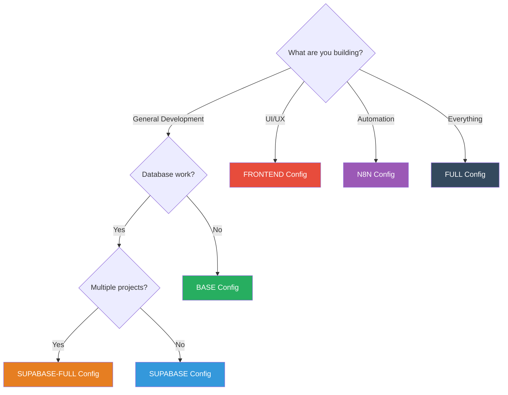
```mermaid
graph TD
    Start{What are you building?}

    Start -->|General Development| CheckDB{Database work?}
    Start -->|UI/UX| Frontend[FRONTEND Config]
    Start -->|Automation| N8N[N8N Config]
    Start -->|Everything| Full[FULL Config]

    CheckDB -->|Yes| CheckMulti{Multiple projects?}
    CheckDB -->|No| Base[BASE Config]

    CheckMulti -->|Yes| SupabaseFull[SUPABASE-FULL Config]
    CheckMulti -->|No| Supabase[SUPABASE Config]

    style Base fill:#27AE60,color:#fff
    style Supabase fill:#3498DB,color:#fff
    style SupabaseFull fill:#E67E22,color:#fff
    style Frontend fill:#E74C3C,color:#fff
    style N8N fill:#9B59B6,color:#fff
    style Full fill:#34495E,color:#fff
```

---

## Behavioral OS (CLAUDE.md) Architecture

### Prime Directives Enforcement

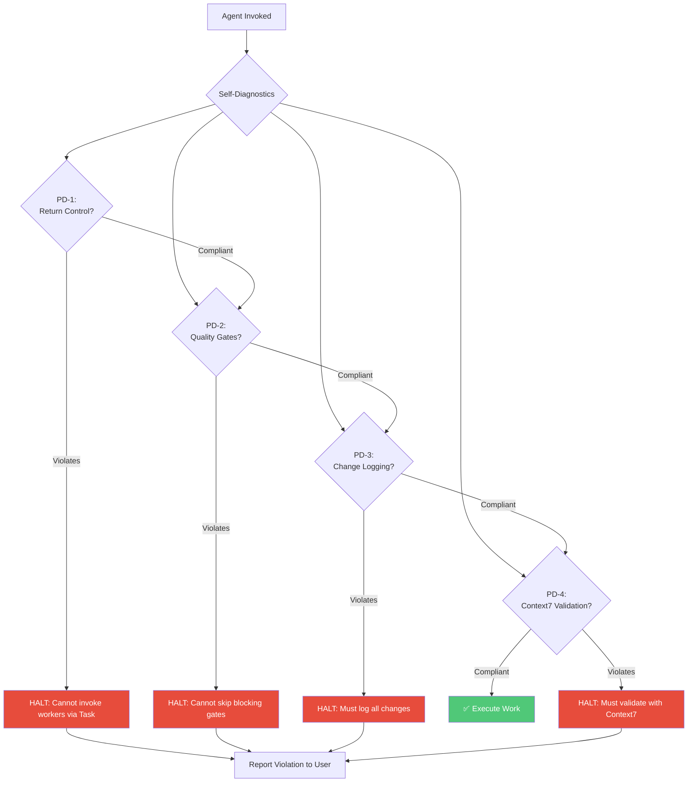
```mermaid
graph TB
    AgentStart[Agent Invoked] --> SelfDiag{Self-Diagnostics}

    SelfDiag --> CheckPD1{PD-1:<br/>Return Control?}
    SelfDiag --> CheckPD2{PD-2:<br/>Quality Gates?}
    SelfDiag --> CheckPD3{PD-3:<br/>Change Logging?}
    SelfDiag --> CheckPD4{PD-4:<br/>Context7 Validation?}

    CheckPD1 -->|Compliant| CheckPD2
    CheckPD1 -->|Violates| Halt1[HALT: Cannot invoke workers via Task]

    CheckPD2 -->|Compliant| CheckPD3
    CheckPD2 -->|Violates| Halt2[HALT: Cannot skip blocking gates]

    CheckPD3 -->|Compliant| CheckPD4
    CheckPD3 -->|Violates| Halt3[HALT: Must log all changes]

    CheckPD4 -->|Compliant| Execute[✅ Execute Work]
    CheckPD4 -->|Violates| Halt4[HALT: Must validate with Context7]

    Halt1 & Halt2 & Halt3 & Halt4 --> Report[Report Violation to User]

    style Execute fill:#50C878,color:#fff
    style Halt1 fill:#E74C3C,color:#fff
    style Halt2 fill:#E74C3C,color:#fff
    style Halt3 fill:#E74C3C,color:#fff
    style Halt4 fill:#E74C3C,color:#fff
```

---

## Summary

### Key Architectural Patterns

1. **Return Control Pattern** — Prevents context nesting, enables rollback
2. **Quality Gates** — Automated validation checkpoints
3. **Iterative Workflows** — Bounded loops with max iterations
4. **Plan → Execute → Report** — Standardized communication protocol
5. **Graceful Degradation** — Fallback strategies for failures
6. **Observability** — TodoWrite, reports, logs for transparency
7. **Fail-Fast with Rollback** — Detect errors early, restore state
8. **Behavioral OS (CLAUDE.md)** — Constitutional rules for all agents

### Component Summary

| Component | Purpose | Count | Examples |
|-----------|---------|-------|----------|
| **Orchestrators** | Coordinate multi-phase workflows | 4 | bug-orchestrator, security-orchestrator |
| **Workers** | Execute specific tasks from plans | 25+ | bug-hunter, bug-fixer, security-scanner |
| **Simple Agents** | Standalone utilities | 4+ | code-reviewer, technical-writer |
| **Skills** | Reusable utility functions | 15+ | run-quality-gate, validate-plan-file |
| **MCP Configs** | External service integrations | 6 | BASE, SUPABASE, FULL |
| **Quality Gates** | Validation scripts | 3+ | check-bundle-size, check-security |

---

## Related Documentation

- **Tutorial**: [TUTORIAL-CUSTOM-AGENTS.md](./TUTORIAL-CUSTOM-AGENTS.md) — Create custom agents
- **Use Cases**: [USE-CASES.md](./USE-CASES.md) — Real-world examples
- **Performance**: [PERFORMANCE-OPTIMIZATION.md](./PERFORMANCE-OPTIMIZATION.md) — Token optimization
- **FAQ**: [FAQ.md](./FAQ.md) — Common questions
- **Behavioral OS**: [../CLAUDE.md](../CLAUDE.md) — Prime Directives and contracts
- **Detailed Specs**: [Agents Ecosystem/](./Agents%20Ecosystem/) — Full specifications

---

**Architecture Version**: 3.0
**Last Updated**: 2025-01-11
**Maintained by**: [Igor Maslennikov](https://github.com/maslennikov-ig)
