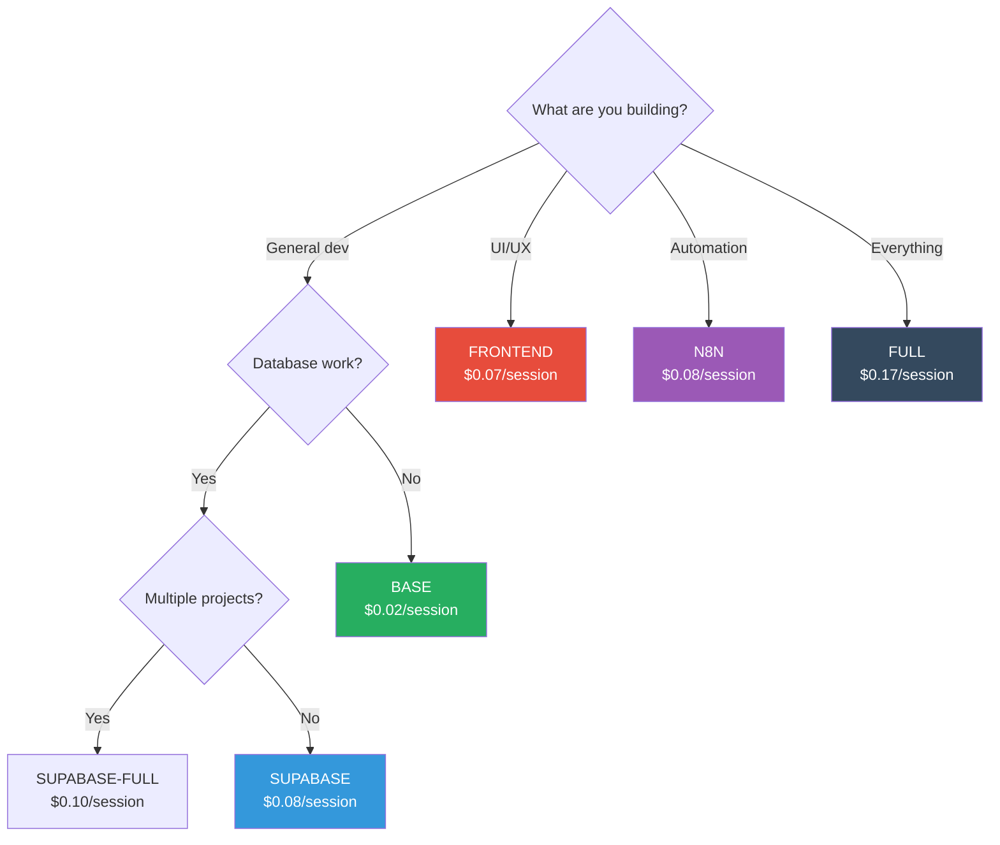

# ⚡ Performance & Token Optimization Guide

## Table of Contents

- [Token Usage by Configuration](#token-usage-by-configuration)
- [Cost Optimization Strategies](#cost-optimization-strategies)
- [MCP Configuration Selection](#mcp-configuration-selection)
- [Workflow Optimization](#workflow-optimization)
- [Best Practices](#best-practices)

---

## Token Usage by Configuration

### Configuration Comparison

| Configuration | Tokens/Session | Servers | Cost/Session | Use Cases |
|---------------|----------------|---------|--------------|-----------|
| **BASE** | ~600 | 2 | $0.02 | Daily development, code review, refactoring |
| **SUPABASE** | ~2,500 | 3 | $0.08 | Database design, RLS policies, SQL queries |
| **SUPABASE-FULL** | ~3,000 | 4 | $0.10 | Multi-project database work |
| **N8N** | ~2,500 | 4 | $0.08 | Workflow automation, n8n integration |
| **FRONTEND** | ~2,000 | 4 | $0.07 | UI/UX, Playwright testing, ShadCN components |
| **FULL** | ~5,000 | 8 | $0.17 | Complex multi-integration work |

**Cost calculation**: Based on Claude Sonnet 4.5 pricing (~$3/million input tokens, ~$15/million output tokens)

---

## Cost Optimization Strategies

### 1. Use BASE Configuration as Default

**Recommendation**: Use BASE config 80% of the time, switch only when needed.

**Savings example**:
```
# ❌ Using FULL all day (8 hours, 20 sessions)
20 sessions × $0.17 = $3.40/day × 22 days = $74.80/month

# ✅ Using BASE mostly (16 BASE + 4 SUPABASE sessions)
16 × $0.02 + 4 × $0.08 = $0.64/day × 22 = $14.08/month

# Savings: $60.72/month per developer
# For team of 10: $607.20/month = $7,286.40/year
```

### 2. Switch Configurations Dynamically

```bash
# Start day with BASE
./switch-mcp.sh  # Select option 1 (BASE)

# Switch to SUPABASE for database work
./switch-mcp.sh  # Select option 2 (SUPABASE)
# ... do database work ...

# Switch back to BASE
./switch-mcp.sh  # Select option 1 (BASE)
```

### 3. Use Specialized Configs Only When Needed

| Task | Wrong Config | Right Config | Savings |
|------|--------------|--------------|---------|
| Code review | FULL ($0.17) | BASE ($0.02) | 88% |
| Bug fixing | FULL ($0.17) | BASE ($0.02) | 88% |
| Database design | FULL ($0.17) | SUPABASE ($0.08) | 53% |
| UI prototyping | FULL ($0.17) | FRONTEND ($0.07) | 59% |
| n8n workflows | FULL ($0.17) | N8N ($0.08) | 53% |

### 4. Monitor Token Usage

**Track usage per config:**
```bash
# Add to ~/.zshrc or ~/.bashrc
alias mcp-base='./switch-mcp.sh -s base && echo "BASE mode: ~$0.02/session"'
alias mcp-supabase='./switch-mcp.sh -s supabase && echo "SUPABASE mode: ~$0.08/session"'
alias mcp-full='./switch-mcp.sh -s full && echo "FULL mode: ~$0.17/session WARNING: High cost"'
```

---

## MCP Configuration Selection

### Decision Tree



### Configuration Recommendations by Task

#### Daily Development Tasks

| Task | Recommended Config | Cost | Alternative |
|------|-------------------|------|-------------|
| Code review | BASE | $0.02 | — |
| Refactoring | BASE | $0.02 | — |
| Bug fixing | BASE | $0.02 | — |
| Writing tests | BASE | $0.02 | — |
| Documentation | BASE | $0.02 | — |

**Savings vs FULL**: 88% ($0.15 per session)

#### Database Tasks

| Task | Recommended Config | Cost | Alternative |
|------|-------------------|------|-------------|
| Schema design | SUPABASE | $0.08 | FULL ($0.17) |
| RLS policies | SUPABASE | $0.08 | FULL ($0.17) |
| SQL queries | SUPABASE | $0.08 | FULL ($0.17) |
| Migrations | SUPABASE | $0.08 | FULL ($0.17) |
| Multi-project | SUPABASE-FULL | $0.10 | FULL ($0.17) |

**Savings vs FULL**: 53-70%

#### Frontend Tasks

| Task | Recommended Config | Cost | Alternative |
|------|-------------------|------|-------------|
| UI prototyping | FRONTEND | $0.07 | FULL ($0.17) |
| Component design | FRONTEND | $0.07 | FULL ($0.17) |
| Browser testing | FRONTEND | $0.07 | FULL ($0.17) |
| Accessibility | FRONTEND | $0.07 | FULL ($0.17) |

**Savings vs FULL**: 59%

---

## Workflow Optimization

### Pattern 1: Start Small, Expand as Needed

```bash
# ✅ Optimal workflow
1. Start with BASE config
2. Identify need for specialized MCP
3. Switch to specialized config
4. Complete task
5. Switch back to BASE

# ❌ Wasteful workflow
1. Use FULL config all day
2. Pay 5-8x more for no benefit
```

### Pattern 2: Batch Similar Tasks

```bash
# ✅ Efficient batching
# Switch to SUPABASE once, do all database work
./switch-mcp.sh -s supabase
- Design schema
- Write RLS policies
- Create migrations
- Test queries
./switch-mcp.sh -s base

# ❌ Inefficient switching
# Switch multiple times for same domain
./switch-mcp.sh -s supabase  # Design schema
./switch-mcp.sh -s base
./switch-mcp.sh -s supabase  # Write policies (wasteful switch)
./switch-mcp.sh -s base
```

### Pattern 3: Plan Your Day

```bash
# Morning: Database work (SUPABASE)
09:00 - 11:00: Schema design, RLS policies

# Midday: General development (BASE)
11:00 - 15:00: Bug fixes, refactoring, code review

# Afternoon: UI work (FRONTEND)
15:00 - 17:00: Component design, browser testing

# Total cost:
# SUPABASE: 4 sessions × $0.08 = $0.32
# BASE: 8 sessions × $0.02 = $0.16
# FRONTEND: 4 sessions × $0.07 = $0.28
# Daily total: $0.76

# vs Using FULL all day:
# FULL: 16 sessions × $0.17 = $2.72
# Savings: $1.96/day = $43.12/month = $517.44/year per developer
```

---

## Best Practices

### 1. Default to BASE

**Rule**: If you're not sure which config to use, use BASE.

**Reasoning**: BASE handles 80% of tasks at 12% the cost of FULL.

### 2. Measure Before Optimizing

**Track usage for 1 week:**
```bash
# Create simple log
echo "$(date): BASE config used" >> ~/.mcp-usage.log

# Review weekly
cat ~/.mcp-usage.log | sort | uniq -c
```

**Analyze**:
- Which config used most?
- Any unnecessary FULL usage?
- Opportunities to batch tasks?

### 3. Team Guidelines

**Establish team standards:**
```markdown
# Team MCP Configuration Policy

## Default Configuration
- Use **BASE** for all general development work

## When to Switch
- **SUPABASE**: Database schema, RLS policies, SQL queries
- **FRONTEND**: UI design, browser testing (Playwright)
- **N8N**: Workflow automation only
- **FULL**: Only with team lead approval

## Cost Targets
- Average cost/developer/month: < $20
- If exceeding $30/month: Review usage with team lead
```

### 4. Automate Switching

**Create convenience aliases:**
```bash
# Add to ~/.zshrc or ~/.bashrc

# Quick switch aliases
alias mcp='./switch-mcp.sh'
alias mcp:base='./switch-mcp.sh -s base && echo "✅ BASE mode ($0.02/session)"'
alias mcp:db='./switch-mcp.sh -s supabase && echo "✅ SUPABASE mode ($0.08/session)"'
alias mcp:ui='./switch-mcp.sh -s frontend && echo "✅ FRONTEND mode ($0.07/session)"'
alias mcp:full='./switch-mcp.sh -s full && echo "⚠️  FULL mode ($0.17/session - HIGH COST)"'

# Show current config
alias mcp:show='cat .mcp.json | grep "mcpServers" | head -5'
```

### 5. CI/CD Optimization

**Use BASE in CI/CD pipelines:**
```yaml
# .github/workflows/health-check.yml
env:
  MCP_CONFIG: base  # Use BASE for CI (cheapest)

jobs:
  health-check:
    steps:
      - name: Run health checks
        run: |
          cp mcp/.mcp.base.json .mcp.json
          claude-code /health-bugs
```

**Reasoning**: CI/CD doesn't need expensive MCPs, BASE is sufficient.

---

## Cost Scenarios

### Scenario 1: Solo Developer

**Usage pattern:**
- 8 hours/day coding
- 20 sessions/day
- 22 working days/month

**Baseline (FULL all day):**
```
20 sessions × $0.17 = $3.40/day
$3.40 × 22 = $74.80/month
```

**Optimized (BASE 80%, SUPABASE 20%):**
```
16 BASE sessions × $0.02 = $0.32
4 SUPABASE sessions × $0.08 = $0.32
Total: $0.64/day × 22 = $14.08/month
```

**Savings**: $60.72/month = $728.64/year

---

### Scenario 2: Small Team (5 developers)

**Usage pattern per developer:**
- BASE: 16 sessions/day
- SUPABASE: 3 sessions/day
- FRONTEND: 1 session/day

**Monthly cost per developer:**
```
BASE: 16 × 22 × $0.02 = $7.04
SUPABASE: 3 × 22 × $0.08 = $5.28
FRONTEND: 1 × 22 × $0.07 = $1.54
Total: $13.86/developer/month
```

**Team cost:**
```
5 developers × $13.86 = $69.30/month
```

**vs Using FULL:**
```
5 developers × 20 sessions × 22 days × $0.17 = $374/month
```

**Savings**: $304.70/month = $3,656.40/year

---

### Scenario 3: Enterprise Team (20 developers)

**Usage pattern:**
- Mixed usage across BASE, SUPABASE, FRONTEND, N8N
- Average cost: $15/developer/month

**Team cost:**
```
20 developers × $15 = $300/month = $3,600/year
```

**vs Using FULL:**
```
20 developers × $74.80 = $1,496/month = $17,952/year
```

**Savings**: $14,352/year

---

## Token Budget Management

### Emergency Protocols

From CLAUDE.md (Behavioral OS):

**At 180k tokens (90% budget):**
- Agents automatically simplify workflows
- Minimal reports (essential sections only)
- Essential Context7 queries only
- No optional validations

**At 195k tokens (97.5% budget):**
- HALT workflow immediately
- Generate emergency summary
- Exit gracefully
- User starts new session

**Prevention strategies:**

1. **Use BASE config** (saves 90% vs FULL)
2. **Clear context periodically** (`/clear` command)
3. **Break large workflows** into smaller chunks
4. **Switch configs dynamically** (don't use FULL all day)

---

## Monitoring & Analytics

### Track MCP Usage

**Simple tracking script:**
```bash
#!/bin/bash
# save as: scripts/track-mcp-usage.sh

CONFIG=$(cat .mcp.json | jq -r '.mcpServers | keys | @csv' | tr -d '"')
TIMESTAMP=$(date '+%Y-%m-%d %H:%M:%S')
COST=0

case $CONFIG in
  *context7*server-sequential-thinking*)
    COST=0.02
    NAME="BASE"
    ;;
  *supabase*)
    COST=0.08
    NAME="SUPABASE"
    ;;
  *playwright*)
    COST=0.07
    NAME="FRONTEND"
    ;;
  *)
    COST=0.17
    NAME="FULL"
    ;;
esac

echo "$TIMESTAMP,$NAME,$COST" >> ~/.mcp-usage-log.csv
```

**Monthly report:**
```bash
#!/bin/bash
# Generate monthly usage report

echo "MCP Usage Report - $(date '+%B %Y')"
echo "========================================"
echo ""

awk -F',' '
BEGIN { base=0; supabase=0; frontend=0; full=0; }
/BASE/ { base+=$3 }
/SUPABASE/ { supabase+=$3 }
/FRONTEND/ { frontend+=$3 }
/FULL/ { full+=$3 }
END {
  total = base + supabase + frontend + full
  printf "BASE:      $%.2f (%.1f%%)\n", base, (base/total)*100
  printf "SUPABASE:  $%.2f (%.1f%%)\n", supabase, (supabase/total)*100
  printf "FRONTEND:  $%.2f (%.1f%%)\n", frontend, (frontend/total)*100
  printf "FULL:      $%.2f (%.1f%%)\n", full, (full/total)*100
  printf "\nTotal:     $%.2f\n", total
}
' ~/.mcp-usage-log.csv
```

---

## Summary

### Key Takeaways

1. **Use BASE as default** — 80% of tasks, 12% of FULL cost
2. **Switch dynamically** — Use specialized configs only when needed
3. **Batch similar tasks** — Minimize config switches
4. **Plan your day** — Group tasks by MCP requirements
5. **Monitor usage** — Track costs, optimize high-usage patterns

### Cost Comparison

| Approach | Monthly Cost (per dev) | Savings vs FULL |
|----------|------------------------|----------------|
| FULL all day | $74.80 | 0% (baseline) |
| Optimized (BASE 80%) | $14.08 | 81% |
| Optimized (team policy) | $15.00 | 80% |

### ROI

**Investment**: Time to learn MCP switching (~1 hour)
**Return**: $60-70/month per developer
**Payback period**: < 1 day

---

## Additional Resources

- **FAQ**: [FAQ.md](./FAQ.md) — MCP configuration questions
- **Architecture**: [ARCHITECTURE.md](./ARCHITECTURE.md) — System design
- **Migration**: [MIGRATION-GUIDE.md](./MIGRATION-GUIDE.md) — Setup guide

---

**Document Version**: 1.0
**Last Updated**: 2025-01-11
**Maintained by**: [Igor Maslennikov](https://github.com/maslennikov-ig)
