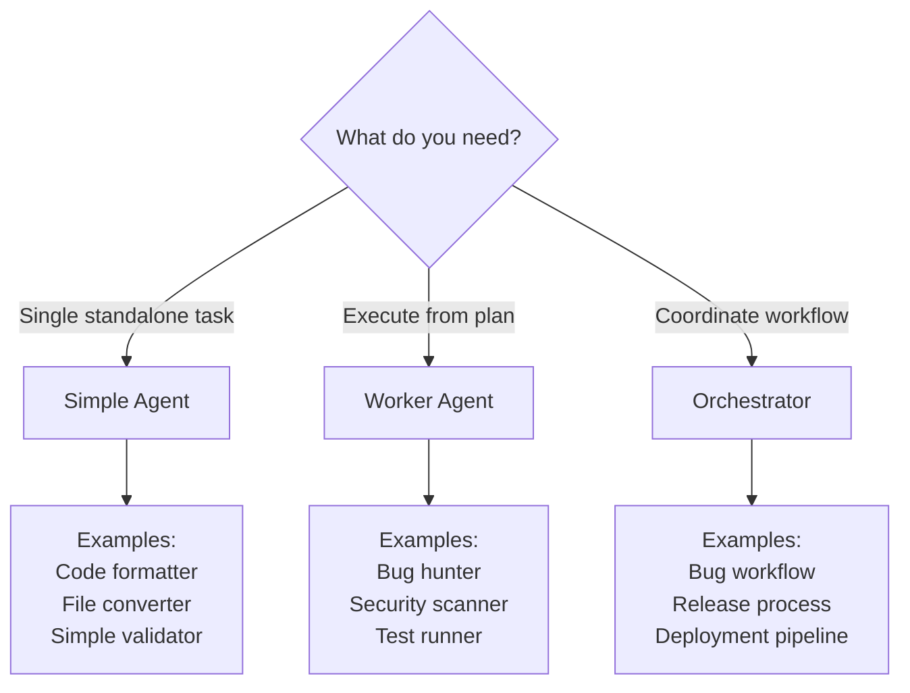

# 🎓 Tutorial: Creating Custom Agents

## Table of Contents

- [Introduction](#introduction)
- [Prerequisites](#prerequisites)
- [Quick Start with Meta Agent](#quick-start-with-meta-agent)
- [Manual Agent Creation](#manual-agent-creation)
- [Tutorial 1: Simple Agent](#tutorial-1-simple-agent)
- [Tutorial 2: Worker Agent](#tutorial-2-worker-agent)
- [Tutorial 3: Orchestrator Agent](#tutorial-3-orchestrator-agent)
- [Tutorial 4: Creating a Skill](#tutorial-4-creating-a-skill)
- [Best Practices](#best-practices)
- [Testing Your Agent](#testing-your-agent)
- [Troubleshooting](#troubleshooting)

---

## Introduction

This tutorial teaches you how to create custom agents for Claude Code Orchestrator Kit. You'll learn:

- The difference between agent types (Simple, Worker, Orchestrator)
- How to use the meta-agent for automated creation
- How to manually create agents following ARCHITECTURE.md patterns
- Best practices for agent design
- How to test and debug your agents

**Time to complete**: 30-60 minutes per tutorial

---

## Prerequisites

### Required Knowledge

- Basic understanding of Markdown
- Familiarity with Claude Code
- Understanding of your project's domain

### Optional Knowledge (Helpful)

- TypeScript/JavaScript (for quality gates)
- Git workflows
- Testing concepts

### Setup

Ensure you have:
```bash
# 1. Claude Code Orchestrator Kit installed
ls .claude/agents/

# 2. MCP configuration active
cat .mcp.json

# 3. CLAUDE.md and ARCHITECTURE.md available
ls CLAUDE.md docs/Agents\ Ecosystem/ARCHITECTURE.md
```

---

## Quick Start with Meta Agent

The **fastest way** to create agents is using the meta-agent:

###  Step-by-Step

```
1. Ask Claude Code:
   "Create a worker agent for linting TypeScript files with ESLint"

2. Meta-agent will ask:
   - Agent type? (worker/orchestrator/simple)
   - Domain category? (health/development/testing/etc)
   - Additional details specific to type

3. Meta-agent will:
   - Read ARCHITECTURE.md patterns
   - Generate agent file with proper structure
   - Validate against checklist
   - Write to .claude/agents/{category}/{type}/{name}.md

4. Review generated agent:
   - Check YAML frontmatter
   - Verify phases/instructions
   - Customize domain logic if needed

5. Test agent:
   "Use eslint-worker to lint src/ directory"
```

### Example Interaction

```
User: Create a worker agent for formatting code with Prettier

Meta-agent: I'll create a code-formatter worker agent. Let me gather requirements:

1. Agent type: Worker
2. Domain: development
3. Purpose: Format code with Prettier
4. Input: File paths or directories
5. Output: Formatted files + report
6. Validation: Check formatting is consistent

[Generates agent following worker pattern...]

✅ Worker Created: .claude/agents/development/workers/prettier-formatter.md

Components:
- YAML frontmatter ✓
- 5-phase structure ✓
- MCP integration (Context7 for config best practices) ✓
- Error handling ✓

Next Steps:
1. Review .claude/agents/development/workers/prettier-formatter.md
2. Customize Prettier options if needed
3. Test with: "Use prettier-formatter on src/"
```

---

## Manual Agent Creation

For full control, create agents manually following these steps.

### Step 1: Choose Agent Type

| Type | Use When | Complexity |
|------|----------|------------|
| **Simple Agent** | Single task, no coordination needed | Low |
| **Worker** | Execute specific task from plan file | Medium |
| **Orchestrator** | Coordinate multi-phase workflow | High |

**Decision tree:**



### Step 2: Create File

```bash
# Simple agent
touch .claude/agents/my-agent.md

# Worker agent
mkdir -p .claude/agents/{domain}/workers/
touch .claude/agents/{domain}/workers/my-worker.md

# Orchestrator
mkdir -p .claude/agents/{domain}/orchestrators/
touch .claude/agents/{domain}/orchestrators/my-orchestrator.md
```

### Step 3: Add YAML Frontmatter

```yaml
---
name: my-agent-name
description: Use proactively for {task}. Expert in {domain}. Handles {scenarios}.
model: sonnet
color: cyan
---
```

**Color codes by domain:**
- `blue` - Health/Quality
- `cyan` - Meta/Tools
- `green` - Success/Validation
- `purple` - Infrastructure
- `orange` - Development

### Step 4: Follow Pattern

See tutorials below for specific patterns.

---

## Tutorial 1: Simple Agent

**Goal**: Create a code formatter agent that runs Prettier on specified files.

### Step 1: Plan the Agent

**Requirements:**
- Input: File paths or directories
- Action: Run prettier with project config
- Output: Formatted files + summary
- Error handling: Report files that failed

### Step 2: Create File

```bash
touch .claude/agents/prettier-formatter.md
```

### Step 3: Write Agent

```markdown
---
name: prettier-formatter
description: Use proactively for code formatting with Prettier. Expert in consistent code style. Handles JavaScript, TypeScript, JSON, Markdown files.
model: sonnet
color: orange
---

# Prettier Formatter

Simple agent that formats code files using Prettier with project configuration.

## When to Use

- Before committing code
- After refactoring
- When code style is inconsistent
- When onboarding new team members

## Input

User specifies:
- **Files**: Specific file paths (e.g., `src/utils/helper.ts`)
- **Directories**: Format all files in directory (e.g., `src/`)
- **Glob patterns**: Pattern matching (e.g., `src/**/*.ts`)

## Instructions

1. **Verify Prettier is available**
   ```bash
   which prettier || npx prettier --version
   ```
   If not found, use `npx prettier`.

2. **Check for Prettier config**
   - Look for `.prettierrc`, `.prettierrc.json`, `prettier.config.js`
   - If found, use project config
   - If not found, use defaults

3. **Format files**
   ```bash
   npx prettier --write {files or directories}
   ```

4. **Check for errors**
   - If formatting succeeds → Report success
   - If syntax errors → Report which files failed

5. **Generate summary**
   ```
   ✅ Code Formatting Complete

   Formatted: 42 files
   Failed: 2 files (syntax errors)

   Files formatted:
   - src/utils/helper.ts
   - src/components/Button.tsx
   - ...

   Files with errors:
   - src/broken.ts (SyntaxError: Unexpected token)
   ```

## Output Format

**Success:**
```
✅ Formatted {N} files successfully
```

**Partial success:**
```
⚠️ Formatted {N} files, {M} failed
See details above for errors
```

**Failure:**
```
❌ Formatting failed
Prettier not found or configuration error
```

## Error Handling

- **Prettier not installed**: Install via `npm install -D prettier`
- **Syntax errors**: Report files, don't halt (format others)
- **Config errors**: Use defaults with warning
- **Permission errors**: Report inaccessible files

## Examples

### Format single file
```
Use prettier-formatter on src/utils/helper.ts
```

### Format directory
```
Use prettier-formatter on src/components/
```

### Format with glob
```
Use prettier-formatter on "src/**/*.{ts,tsx}"
```

---

**This is a Simple Agent**: No plan files, no reports, direct execution.
```

### Step 4: Test Agent

```
# Test with single file
Ask Claude Code: "Use prettier-formatter on src/index.ts"

# Test with directory
Ask Claude Code: "Use prettier-formatter on src/"

# Verify output
Check that files are formatted correctly
```

### Key Takeaways

**Simple agents:**
- ✅ Standalone, no coordination
- ✅ Direct input from user
- ✅ Immediate execution
- ✅ Simple output format
- ❌ No plan files
- ❌ No structured reports
- ❌ No quality gates

---

## Tutorial 2: Worker Agent

**Goal**: Create a test coverage worker that analyzes test coverage from plan file.

### Step 1: Plan the Worker

**Requirements:**
- Input: Plan file (`.test-coverage-plan.json`)
- Plan contains: Threshold (%), directories to check
- Action: Run coverage tool, analyze results
- Output: Structured report with pass/fail
- Quality gates: Coverage must meet threshold

### Step 2: Create File

```bash
mkdir -p .claude/agents/testing/workers/
touch .claude/agents/testing/workers/test-coverage-analyzer.md
```

### Step 3: Write Worker

```markdown
---
name: test-coverage-analyzer
description: Use proactively for test coverage analysis. Expert in code coverage metrics. Analyzes coverage reports and validates against thresholds.
model: sonnet
color: green
---

# Test Coverage Analyzer

Worker agent that analyzes test coverage from coverage reports and validates against thresholds specified in plan file.

## Purpose

Invoked by orchestrators to validate test coverage meets quality standards during:
- Bug fixing workflows
- Feature development
- Release validation
- CI/CD pipelines

## Phase 1: Read Plan File

**Location**: `.tmp/current/plans/.test-coverage-plan.json`

**Expected structure:**
```json
{
  "phase": 1,
  "config": {
    "threshold": 80,
    "directories": ["src/", "lib/"],
    "excludePatterns": ["**/*.test.ts", "**/*.spec.ts"]
  },
  "validation": {
    "required": ["coverage-check"],
    "optional": []
  },
  "nextAgent": "test-coverage-analyzer"
}
```

**Steps:**
1. Read plan file from `.tmp/current/plans/.test-coverage-plan.json`
2. Extract `threshold` (minimum % required)
3. Extract `directories` (paths to check)
4. Extract `excludePatterns` (files to ignore)
5. Validate plan has required fields

**If plan missing:**
- Create default plan:
  ```json
  {
    "threshold": 70,
    "directories": ["src/"],
    "excludePatterns": []
  }
  ```
- Log warning: "Plan file missing, using defaults"

## Phase 2: Generate Coverage Report

**Steps:**

1. **Run coverage tool**
   ```bash
   npm run test:coverage
   # Or: npx jest --coverage
   # Or: npx vitest run --coverage
   ```

2. **Locate coverage report**
   - Look for: `coverage/coverage-summary.json`
   - Or: `coverage/lcov.info`
   - Parse coverage data

3. **Extract metrics**
   - **Lines**: % of lines covered
   - **Branches**: % of branches covered
   - **Functions**: % of functions covered
   - **Statements**: % of statements covered

4. **Calculate by directory**
   - Group files by directory from plan config
   - Calculate coverage per directory
   - Identify low-coverage files

## Phase 3: Analyze Coverage

**Steps:**

1. **Compare against threshold**
   ```
   If coverage >= threshold:
     Status = PASS
   Else:
     Status = FAIL
   ```

2. **Identify coverage gaps**
   - Files below threshold
   - Uncovered branches
   - Untested functions

3. **Calculate coverage trend**
   - Compare to previous run (if available)
   - Identify improvement or regression

## Phase 4: Validate Work

**Validation criteria:**

1. **Coverage report generated?**
   - Check `coverage/` directory exists
   - Check report files present

2. **Coverage meets threshold?**
   - Compare total coverage vs threshold
   - Check per-directory coverage

3. **Report is parsable?**
   - JSON is valid
   - All expected fields present

**Validation status:**
- ✅ PASSED: Coverage >= threshold, report valid
- ⚠️ PARTIAL: Coverage < threshold but report valid
- ❌ FAILED: Coverage tool failed or report invalid

## Phase 5: Generate Report

**Use `generate-report-header` Skill** for header.

**Report structure:**

````markdown
# Test Coverage Analysis Report

**Generated**: 2025-01-11T14:30:00Z
**Worker**: test-coverage-analyzer
**Phase**: 1
**Status**: ✅ PASSED

---

## Executive Summary

Test coverage meets quality standards.

**Key Metrics**:
- Total Coverage: 84.5%
- Threshold: 80%
- Files Analyzed: 127
- Directories: src/, lib/

**Validation Status**: ✅ PASSED

**Critical Findings**:
- Coverage exceeds threshold by 4.5%
- 3 files below 60% coverage (see details)

---

## Coverage Metrics

### Overall Coverage

| Metric | Coverage | Status |
|--------|----------|--------|
| Lines | 84.5% | ✅ Pass |
| Branches | 78.2% | ⚠️ Near Threshold |
| Functions | 89.1% | ✅ Pass |
| Statements | 84.3% | ✅ Pass |

### By Directory

| Directory | Coverage | Status |
|-----------|----------|--------|
| src/utils/ | 92.3% | ✅ Excellent |
| src/components/ | 81.7% | ✅ Pass |
| lib/helpers/ | 75.4% | ⚠️ Near Threshold |

---

## Low Coverage Files

Files below 70% coverage:

1. **src/utils/legacy.ts** - 45.2%
   - 23/51 lines uncovered
   - Recommend: Add tests for edge cases

2. **lib/helpers/parser.ts** - 58.9%
   - 18/44 lines uncovered
   - Recommend: Test error handling paths

3. **src/api/client.ts** - 62.1%
   - 15/40 lines uncovered
   - Recommend: Test async error cases

---

## Validation Results

### Check 1: Coverage Report Generated
- **Command**: `npm run test:coverage`
- **Result**: ✅ PASSED
- **Details**: Report generated at coverage/coverage-summary.json

### Check 2: Coverage Meets Threshold
- **Threshold**: 80%
- **Actual**: 84.5%
- **Result**: ✅ PASSED
- **Details**: Exceeds threshold by 4.5%

**Overall Validation**: ✅ PASSED

---

## Metrics

- **Total Duration**: ~2m 15s
- **Files Analyzed**: 127
- **Validation Checks**: 2/2 passed

---

## Errors Encountered

✅ No errors encountered

---

## Next Steps

1. Orchestrator can proceed to next phase
2. Consider adding tests for low-coverage files
3. Monitor branch coverage (near threshold)

---

## Artifacts

- Plan file: `.tmp/current/plans/.test-coverage-plan.json`
- This report: `.tmp/current/reports/test-coverage-report.md`
- Coverage data: `coverage/coverage-summary.json`

---

**Test Coverage Analyzer execution complete.**

✅ Ready for orchestrator validation and next phase.
````

**If validation FAILED:**
```markdown
❌ Work failed validation. Coverage below threshold (84.5% < 90%).

## Recovery Steps

1. Review low-coverage files above
2. Add tests to increase coverage
3. Re-run coverage analysis
4. Alternative: Lower threshold with justification
```

## Phase 6: Return Control

**Steps:**

1. **Report summary to user**
   ```
   ✅ Test Coverage Analysis Complete

   Coverage: 84.5% (threshold: 80%)
   Status: PASSED

   See full report: .tmp/current/reports/test-coverage-report.md
   ```

2. **Exit** (orchestrator resumes)

**DO NOT:**
- ❌ Invoke other agents
- ❌ Continue without orchestrator
- ❌ Skip report generation

---

## Error Handling

### Coverage Tool Failed

**Symptoms**: `npm run test:coverage` exits with error

**Actions:**
1. Log error to report
2. Check if test:coverage script exists in package.json
3. Try alternative: `npx jest --coverage`
4. If all fail: Report FAILED status with error details

### Plan File Invalid

**Symptoms**: Plan file missing required fields

**Actions:**
1. Log validation errors
2. Use default values for missing fields
3. Log warning in report
4. Continue with defaults

### Coverage Below Threshold

**Symptoms**: Coverage < threshold from plan

**Actions:**
1. Mark status as ⚠️ PARTIAL
2. List low-coverage files
3. Provide recommendations
4. Ask orchestrator: continue or fix?

---

## MCP Integration

**Recommended MCP servers:** None required for coverage analysis.

**Optional:** `mcp__context7__*` for best practices on testing frameworks.

---

**This worker follows:**
- ARCHITECTURE.md worker pattern (5 phases)
- REPORT-TEMPLATE-STANDARD.md format
- CLAUDE.md Prime Directives (PD-1, PD-3, PD-6)
```

### Step 4: Test Worker

**Test with orchestrator:**

1. Create test plan file:
   ```json
   {
     "phase": 1,
     "config": {
       "threshold": 80,
       "directories": ["src/"]
     },
     "validation": {
       "required": ["coverage-check"]
     },
     "nextAgent": "test-coverage-analyzer"
   }
   ```
   Save to `.tmp/current/plans/.test-coverage-plan.json`

2. Invoke worker:
   ```
   Ask Claude Code: "Invoke test-coverage-analyzer worker"
   ```

3. Verify:
   - Report generated at `.tmp/current/reports/test-coverage-report.md`
   - Contains all required sections
   - Status is accurate (PASSED/PARTIAL/FAILED)

### Key Takeaways

**Worker agents:**
- ✅ Read plan file FIRST
- ✅ Execute specific task
- ✅ Log changes (PD-3)
- ✅ Generate structured report (PD-6)
- ✅ Return control (PD-1)
- ✅ 5-phase structure
- ❌ No agent invocation
- ❌ No skipping report

---

## Tutorial 3: Orchestrator Agent

**Goal**: Create an orchestrator for test coverage workflow (detection → improvement → verification).

### Step 1: Plan the Orchestrator

**Requirements:**
- Phase 0: Pre-flight (setup)
- Phase 1: Analyze coverage (invoke test-coverage-analyzer)
- Quality Gate 1: Validate analysis report
- Phase 2: Improve coverage (invoke test-improvement-worker)
- Quality Gate 2: Validate improvements
- Phase 3: Verification (invoke test-coverage-analyzer again)
- Final: Summary

### Step 2: Create File

```bash
mkdir -p .claude/agents/testing/orchestrators/
touch .claude/agents/testing/orchestrators/test-coverage-orchestrator.md
```

### Step 3: Write Orchestrator

```markdown
---
name: test-coverage-orchestrator
description: Use proactively for comprehensive test coverage improvement workflow. Expert in orchestrating coverage analysis, test generation, and validation. Handles iterative improvement cycles.
model: sonnet
color: green
---

# Test Coverage Orchestrator

Coordinates multi-phase test coverage improvement workflow with quality gates and iterative refinement.

## Purpose

Automates the complete test coverage improvement process:
1. Analyze current coverage
2. Identify gaps
3. Generate/improve tests
4. Validate improvements
5. Iterate until threshold met

## Workflow Overview

```
Phase 0: Pre-Flight
  ↓
Phase 1: Initial Analysis
  ↓
Quality Gate 1: Validate Analysis
  ↓
Phase 2: Test Generation
  ↓
Quality Gate 2: Validate Generation
  ↓
Phase 3: Verification Analysis
  ↓
Quality Gate 3: Check Coverage Met
  ↓
Final: Summary (or iterate if coverage < threshold)
```

**Max iterations**: 3

---

## Phase 0: Pre-Flight Validation

**Purpose**: Setup environment and validate prerequisites.

**Steps:**

1. **Create directory structure**
   ```bash
   mkdir -p .tmp/current/plans/
   mkdir -p .tmp/current/reports/
   mkdir -p .tmp/current/changes/
   mkdir -p .tmp/current/backups/
   ```

2. **Validate environment**
   - Check test framework exists (Jest, Vitest, etc.)
   - Check coverage tool configured
   - Verify `package.json` has test:coverage script

3. **Initialize tracking**
   ```
   Use TodoWrite:
   - Phase 0: Pre-Flight (in_progress)
   - Phase 1: Initial Analysis (pending)
   - Phase 2: Test Generation (pending)
   - Phase 3: Verification (pending)
   - Phase 4: Summary (pending)
   ```

4. **Parse user input**
   - Coverage threshold (default: 80%)
   - Directories to analyze (default: src/)
   - Max iterations (default: 3)

5. **Mark Phase 0 complete**
   ```
   Update TodoWrite: Phase 0: Pre-Flight (completed)
   ```

---

## Phase 1: Initial Coverage Analysis

**Purpose**: Analyze current test coverage.

**Steps:**

1. **Update progress**
   ```
   TodoWrite: Phase 1: Initial Analysis (in_progress)
   ```

2. **Create plan file**

   Save to `.tmp/current/plans/.test-coverage-plan.json`:
   ```json
   {
     "phase": 1,
     "workflow": "test-coverage",
     "config": {
       "threshold": 80,
       "directories": ["src/", "lib/"],
       "excludePatterns": ["**/*.test.ts", "**/*.spec.ts"]
     },
     "validation": {
       "required": ["coverage-check"],
       "optional": []
     },
     "mcpGuidance": {
       "recommended": ["mcp__context7__*"],
       "library": "jest",
       "reason": "Check current Jest best practices for coverage configuration"
     },
     "nextAgent": "test-coverage-analyzer"
   }
   ```

3. **Validate plan file**
   ```
   Use validate-plan-file Skill to ensure schema is correct
   ```

4. **Signal readiness**
   ```
   Tell user:
   "✅ Ready for test-coverage-analyzer

   Plan file created: .tmp/current/plans/.test-coverage-plan.json
   Next: Invoke test-coverage-analyzer worker"
   ```

5. **EXIT** (Return Control - PD-1)

**WAIT FOR USER** to invoke test-coverage-analyzer.

---

## Quality Gate 1: Validate Initial Analysis

**When**: After test-coverage-analyzer completes Phase 1.

**Steps:**

1. **Check report exists**
   ```bash
   ls .tmp/current/reports/test-coverage-report.md
   ```
   If missing → HALT, report error

2. **Validate report completeness**
   ```
   Use validate-report-file Skill to check:
   - Has Executive Summary
   - Has Coverage Metrics
   - Has Validation Results
   - Has status (PASSED/PARTIAL/FAILED)
   ```

3. **Run quality gate**
   ```
   Use run-quality-gate Skill with:
   - required: ["coverage-report-exists"]
   - optional: []
   ```

4. **Evaluate result**
   - ✅ PASS: Report valid, continue to Phase 2
   - ❌ FAIL: HALT, report error, ask user to fix/skip

5. **Check coverage vs threshold**
   ```
   Read report, extract coverage percentage
   If coverage >= threshold:
     Skip Phase 2 (no improvement needed)
     Jump to Final Summary
   Else:
     Continue to Phase 2
   ```

---

## Phase 2: Test Generation/Improvement

**Purpose**: Generate or improve tests for low-coverage files.

**Steps:**

1. **Update progress**
   ```
   TodoWrite: Phase 2: Test Generation (in_progress)
   ```

2. **Extract low-coverage files**
   - Read test-coverage-report.md
   - Find "Low Coverage Files" section
   - Extract file paths and coverage %

3. **Create test generation plan**

   Save to `.tmp/current/plans/.test-generation-plan.json`:
   ```json
   {
     "phase": 2,
     "workflow": "test-coverage",
     "config": {
       "targetFiles": [
         "src/utils/legacy.ts",
         "lib/helpers/parser.ts"
       ],
       "currentCoverage": 45.2,
       "targetCoverage": 80,
       "testFramework": "jest"
     },
     "validation": {
       "required": ["test-syntax-check"],
       "optional": ["test-execution"]
     },
     "mcpGuidance": {
       "recommended": ["mcp__context7__*"],
       "library": "jest",
       "reason": "Get current Jest testing patterns and best practices"
     },
     "nextAgent": "test-generation-worker"
   }
   ```

4. **Validate plan**
   ```
   Use validate-plan-file Skill
   ```

5. **Signal readiness**
   ```
   Tell user:
   "✅ Ready for test-generation-worker

   Plan file created: .tmp/current/plans/.test-generation-plan.json
   Target files: 2 (src/utils/legacy.ts, lib/helpers/parser.ts)
   Next: Invoke test-generation-worker"
   ```

6. **EXIT** (Return Control)

**WAIT FOR USER** to invoke test-generation-worker.

---

## Quality Gate 2: Validate Test Generation

**When**: After test-generation-worker completes Phase 2.

**Steps:**

1. **Check report exists**
   ```bash
   ls .tmp/current/reports/test-generation-report.md
   ```

2. **Validate report**
   ```
   Use validate-report-file Skill
   ```

3. **Run quality gate**
   ```
   Use run-quality-gate Skill with:
   - required: ["type-check", "test-syntax-check"]
   - optional: ["test-execution"]
   ```

4. **Evaluate result**
   - ✅ PASS: Tests generated and valid, continue to Phase 3
   - ⚠️ PARTIAL: Some tests generated, log warning, continue
   - ❌ FAIL: HALT, initiate rollback

5. **If FAIL:**
   ```
   Use rollback-changes Skill to restore files
   Report failure to user
   Ask: Fix tests manually or skip Phase 2?
   ```

---

## Phase 3: Verification Analysis

**Purpose**: Re-analyze coverage to verify improvement.

**Steps:**

1. **Update progress**
   ```
   TodoWrite: Phase 3: Verification (in_progress)
   ```

2. **Create verification plan**

   Save to `.tmp/current/plans/.test-coverage-plan.json`:
   ```json
   {
     "phase": 3,
     "workflow": "test-coverage",
     "config": {
       "threshold": 80,
       "directories": ["src/", "lib/"],
       "isVerification": true
     },
     "validation": {
       "required": ["coverage-check"],
       "optional": []
     },
     "nextAgent": "test-coverage-analyzer"
   }
   ```

3. **Signal readiness**
   ```
   Tell user:
   "✅ Ready for test-coverage-analyzer (verification)

   Plan file created: .tmp/current/plans/.test-coverage-plan.json
   Next: Invoke test-coverage-analyzer worker"
   ```

4. **EXIT** (Return Control)

**WAIT FOR USER** to invoke test-coverage-analyzer.

---

## Quality Gate 3: Check Coverage Met

**When**: After verification coverage analysis completes.

**Steps:**

1. **Check report exists**
   ```bash
   ls .tmp/current/reports/test-coverage-report.md
   ```

2. **Extract coverage percentage**
   - Read verification report
   - Extract total coverage %

3. **Compare to threshold**
   ```
   If coverage >= threshold:
     Status = SUCCESS
     Proceed to Final Summary
   Else if iteration < maxIterations:
     Status = CONTINUE
     iteration++
     Return to Phase 2 (generate more tests)
   Else:
     Status = PARTIAL_SUCCESS
     Proceed to Final Summary with warning
   ```

4. **Update tracking**
   ```json
   {
     "iteration": 1,
     "maxIterations": 3,
     "coverageHistory": [
       {"iteration": 0, "coverage": 75.2},
       {"iteration": 1, "coverage": 82.5}
     ]
   }
   ```

---

## Final Phase: Summary

**Purpose**: Generate comprehensive summary of workflow.

**Steps:**

1. **Collect all reports**
   ```bash
   ls .tmp/current/reports/
   - test-coverage-report.md (initial)
   - test-generation-report.md
   - test-coverage-report.md (verification)
   ```

2. **Calculate metrics**
   - Initial coverage: X%
   - Final coverage: Y%
   - Improvement: (Y - X)%
   - Tests generated: N
   - Iterations: M

3. **Generate summary report**

````markdown
# Test Coverage Workflow Summary

**Generated**: 2025-01-11T15:45:00Z
**Orchestrator**: test-coverage-orchestrator
**Status**: ✅ SUCCESS

---

## Executive Summary

Test coverage improvement workflow completed successfully.

**Key Results**:
- Initial Coverage: 75.2%
- Final Coverage: 82.5%
- Improvement: +7.3%
- Target Threshold: 80%
- Iterations: 1

**Validation Status**: ✅ PASSED

---

## Workflow Phases

### Phase 1: Initial Analysis
- **Status**: ✅ Complete
- **Coverage**: 75.2%
- **Files Analyzed**: 127
- **Report**: .tmp/current/reports/test-coverage-report.md

### Phase 2: Test Generation
- **Status**: ✅ Complete
- **Tests Generated**: 15
- **Files Covered**: 2 (src/utils/legacy.ts, lib/helpers/parser.ts)
- **Report**: .tmp/current/reports/test-generation-report.md

### Phase 3: Verification
- **Status**: ✅ Complete
- **Final Coverage**: 82.5%
- **Threshold Met**: Yes
- **Report**: .tmp/current/reports/test-coverage-report.md

---

## Coverage Progress

| Iteration | Coverage | Status |
|-----------|----------|--------|
| Initial | 75.2% | ⚠️ Below Threshold |
| After Tests | 82.5% | ✅ Above Threshold |

**Improvement**: +7.3% (75.2% → 82.5%)

---

## Quality Gates

All quality gates passed:
- ✅ Initial Analysis Report Valid
- ✅ Test Generation Successful
- ✅ Type Check Passed
- ✅ Verification Coverage Meets Threshold

---

## Artifacts

- **Plans**: .tmp/current/plans/
  - .test-coverage-plan.json (initial)
  - .test-generation-plan.json
  - .test-coverage-plan.json (verification)

- **Reports**: .tmp/current/reports/
  - test-coverage-report.md (initial)
  - test-generation-report.md
  - test-coverage-report.md (verification)

- **Changes**: .tmp/current/changes/
  - test-generation-changes.json

---

## Next Steps

1. Review generated tests for quality
2. Consider adding edge case tests
3. Monitor coverage in CI/CD
4. Run `/health-bugs` to check for regressions

---

**Test Coverage Orchestrator workflow complete.**
✅ Coverage improved from 75.2% to 82.5% (+7.3%)
````

4. **Archive run**
   ```bash
   timestamp=$(date +"%Y-%m-%d-%H%M%S")
   mkdir -p .tmp/archive/$timestamp/
   cp -r .tmp/current/* .tmp/archive/$timestamp/
   ```

5. **Cleanup**
   ```bash
   rm -rf .tmp/current/*
   ```

6. **Report to user**
   ```
   ✅ Test Coverage Workflow Complete!

   Initial Coverage: 75.2%
   Final Coverage: 82.5%
   Improvement: +7.3%

   Full summary: docs/reports/test-coverage-summary.md
   Archived run: .tmp/archive/2025-01-11-154500/
   ```

---

## Error Handling

### Worker Report Missing

**Symptoms**: Expected report not found after worker invocation.

**Actions:**
1. HALT workflow
2. Check .tmp/current/reports/ for any reports
3. Report error to user: "Worker did not generate report"
4. Ask user: retry worker or abort workflow?

### Quality Gate FAIL (Blocking)

**Symptoms**: Type-check or build fails after worker changes.

**Actions:**
1. STOP workflow immediately
2. Use rollback-changes Skill to restore files
3. Report error details to user
4. Ask user: fix manually or abort?

### Max Iterations Reached

**Symptoms**: iteration >= maxIterations and coverage < threshold.

**Actions:**
1. Generate summary with PARTIAL_SUCCESS status
2. Report final coverage vs threshold
3. List remaining gaps
4. Recommend: manual test writing or lower threshold

---

## Iteration Control

**Max iterations**: 3

**Iteration state tracking**:
```json
{
  "iteration": 1,
  "maxIterations": 3,
  "coverageHistory": [
    {"iteration": 0, "coverage": 75.2, "phase": "initial"},
    {"iteration": 1, "coverage": 82.5, "phase": "after-generation"}
  ],
  "completedPhases": ["initial-analysis", "test-generation", "verification"]
}
```

**Exit conditions:**
- ✅ Coverage >= threshold (success)
- ⛔ Max iterations reached (partial success)
- ❌ Blocking quality gate failed (failure)

---

## MCP Integration

**Recommended MCP servers**:
- `mcp__context7__*` - For test framework best practices
- Optional: `mcp__supabase__*` if testing database code

**MCP guidance in plan files**: See Phase 1, Phase 2 examples above.

---

## TodoWrite Progress Tracking

**Initial state:**
```json
[
  {"content": "Phase 0: Pre-Flight", "status": "pending", "activeForm": "Setting up environment"},
  {"content": "Phase 1: Initial Analysis", "status": "pending", "activeForm": "Analyzing coverage"},
  {"content": "Phase 2: Test Generation", "status": "pending", "activeForm": "Generating tests"},
  {"content": "Phase 3: Verification", "status": "pending", "activeForm": "Verifying improvements"},
  {"content": "Phase 4: Summary", "status": "pending", "activeForm": "Generating summary"}
]
```

**Update as phases complete:**
- in_progress → completed
- Keep EXACTLY ONE task in_progress at a time

---

**This orchestrator follows:**
- ARCHITECTURE.md orchestrator pattern
- CLAUDE.md Prime Directives (PD-1: Return Control, PD-2: Quality Gates)
- Return Control pattern (NO Task tool for worker invocation)
- Quality gates with blocking logic
- Iterative workflow with max iterations
- TodoWrite progress tracking
```

### Step 4: Test Orchestrator

**End-to-end test:**

1. Start workflow:
   ```
   Ask Claude Code: "Run test-coverage-orchestrator to improve coverage to 80%"
   ```

2. Follow orchestrator signals:
   - Phase 1: Orchestrator signals "Ready for test-coverage-analyzer"
   - You invoke: "Invoke test-coverage-analyzer worker"
   - Phase 2: Orchestrator signals "Ready for test-generation-worker"
   - You invoke: "Invoke test-generation-worker"
   - etc.

3. Verify:
   - Each phase completes successfully
   - Quality gates validate correctly
   - Final summary shows coverage improvement
   - Artifacts archived properly

### Key Takeaways

**Orchestrator agents:**
- ✅ Coordinate multi-phase workflows
- ✅ Create plan files for workers
- ✅ Return control (PD-1): NO Task tool
- ✅ Validate at quality gates
- ✅ Track progress via TodoWrite
- ✅ Handle iterations with max limit
- ❌ NO implementation work
- ❌ NO skip quality gates

---

## Tutorial 4: Creating a Skill

**Goal**: Create a `parse-coverage-report` skill that parses coverage JSON into structured data.

### Step 1: Plan the Skill

**Requirements:**
- Input: Coverage JSON file path
- Output: Structured data (lines %, branches %, functions %, statements %)
- Pure function, no side effects
- < 100 lines logic

### Step 2: Decide: Agent or Skill?

**Decision criteria:**
- ✅ Stateless utility function → **Skill**
- ✅ < 100 lines → **Skill**
- ✅ Reusable across agents → **Skill**
- ✅ No coordination needed → **Skill**

**Answer**: This should be a **Skill**.

### Step 3: Create Skill Directory

```bash
mkdir -p .claude/skills/parse-coverage-report/
touch .claude/skills/parse-coverage-report/SKILL.md
```

### Step 4: Write Skill

```markdown
---
name: parse-coverage-report
description: Parse test coverage reports (JSON format) into structured data. Use when you need to extract coverage percentages, file-level metrics, or aggregate statistics from coverage tools.
allowed-tools: Read
---

# Parse Coverage Report

Parses test coverage reports (coverage-summary.json format) into structured data for analysis and reporting.

## When to Use

- Extract coverage percentages from coverage reports
- Aggregate coverage across multiple files/directories
- Compare coverage against thresholds
- Generate coverage summaries
- Identify low-coverage files

## Instructions

### Step 1: Read Coverage Report

**Input**: Path to coverage report (typically `coverage/coverage-summary.json`)

Use Read tool to load report:
```
Read coverage/coverage-summary.json
```

### Step 2: Parse JSON Structure

Expected format:
```json
{
  "total": {
    "lines": {"total": 1000, "covered": 850, "skipped": 0, "pct": 85},
    "statements": {"total": 1200, "covered": 1020, "skipped": 0, "pct": 85},
    "functions": {"total": 150, "covered": 135, "skipped": 0, "pct": 90},
    "branches": {"total": 300, "covered": 240, "skipped": 0, "pct": 80}
  },
  "src/file1.ts": {
    "lines": {"total": 100, "covered": 85, "skipped": 0, "pct": 85},
    ...
  },
  "src/file2.ts": { ... }
}
```

### Step 3: Extract Total Coverage

```
totalCoverage = {
  lines: report.total.lines.pct,
  statements: report.total.statements.pct,
  functions: report.total.functions.pct,
  branches: report.total.branches.pct
}
```

### Step 4: Calculate Per-File Coverage

For each file in report (excluding "total"):
```
fileData[filepath] = {
  lines: report[filepath].lines.pct,
  statements: report[filepath].statements.pct,
  functions: report[filepath].functions.pct,
  branches: report[filepath].branches.pct
}
```

### Step 5: Identify Low Coverage Files

```
lowCoverageFiles = fileData.filter(file => file.lines < threshold)
Sort by coverage (lowest first)
```

### Step 6: Calculate Averages by Directory

```
Group files by directory prefix
Calculate average coverage per directory
```

## Input Format

**Path to coverage report file**:
```
coverage/coverage-summary.json
```

**Optional threshold for low-coverage filter**:
```
threshold: 70  # Files below 70% considered low coverage
```

## Output Format

Return structured object:

```json
{
  "total": {
    "lines": 85.0,
    "statements": 85.0,
    "functions": 90.0,
    "branches": 80.0
  },
  "byDirectory": {
    "src/utils/": {
      "lines": 92.3,
      "statements": 91.7,
      "functions": 94.1,
      "branches": 88.2
    },
    "src/components/": {
      "lines": 81.5,
      "statements": 82.1,
      "functions": 87.3,
      "branches": 75.4
    }
  },
  "lowCoverageFiles": [
    {
      "path": "src/utils/legacy.ts",
      "lines": 45.2,
      "statements": 44.8,
      "functions": 50.0,
      "branches": 40.1
    },
    {
      "path": "lib/helpers/parser.ts",
      "lines": 58.9,
      "statements": 59.2,
      "functions": 65.0,
      "branches": 52.3
    }
  ],
  "filesCount": 127,
  "directoriesCount": 8
}
```

## Examples

### Example 1: Parse and display total coverage

**Input:**
```
Use parse-coverage-report skill on coverage/coverage-summary.json
```

**Output:**
```json
{
  "total": {
    "lines": 85.0,
    "statements": 85.0,
    "functions": 90.0,
    "branches": 80.0
  }
}
```

### Example 2: Find low-coverage files (threshold 70%)

**Input:**
```
Use parse-coverage-report skill on coverage/coverage-summary.json with threshold 70
```

**Output:**
```json
{
  "total": { ... },
  "lowCoverageFiles": [
    {"path": "src/utils/legacy.ts", "lines": 45.2},
    {"path": "lib/helpers/parser.ts", "lines": 58.9}
  ]
}
```

### Example 3: Coverage by directory

**Input:**
```
Use parse-coverage-report skill on coverage/coverage-summary.json, group by directory
```

**Output:**
```json
{
  "total": { ... },
  "byDirectory": {
    "src/utils/": {"lines": 92.3},
    "src/components/": {"lines": 81.5},
    "lib/": {"lines": 75.2}
  }
}
```

## Error Handling

### Report file not found

**Error**: Coverage report doesn't exist at specified path

**Action**: Return error object:
```json
{
  "error": "Coverage report not found",
  "path": "coverage/coverage-summary.json",
  "suggestion": "Run test:coverage first"
}
```

### Invalid JSON format

**Error**: File exists but isn't valid JSON

**Action**:
```json
{
  "error": "Invalid JSON format",
  "details": "Unexpected token at line 5"
}
```

### Missing expected fields

**Error**: JSON structure doesn't match expected format

**Action**:
```json
{
  "error": "Unexpected coverage format",
  "details": "Missing 'total' field",
  "suggestion": "Check if coverage tool is supported (Jest, Vitest, Istanbul)"
}
```

## Notes

- **Tool restriction**: Only Read tool allowed (stateless parsing)
- **Performance**: Fast, no external commands
- **Compatibility**: Supports Istanbul/NYC coverage format (Jest, Vitest)
- **Pure function**: No side effects, same input = same output

---

**This skill follows SKILL.md format and best practices.**
```

### Step 5: Test Skill

```
# Test with actual coverage report
Ask Claude Code: "Use parse-coverage-report skill on coverage/coverage-summary.json"

# Verify output
- Should return structured data
- Total coverage percentages should match report
- Low-coverage files should be identified correctly
```

### Key Takeaways

**Skills:**
- ✅ Stateless utility functions
- ✅ < 100 lines logic
- ✅ Invoked via Skill tool
- ✅ No context isolation
- ✅ Can restrict tools via `allowed-tools`
- ✅ Reusable across multiple agents
- ❌ No stateful workflows
- ❌ No agent coordination

---

## Best Practices

### 1. Follow ARCHITECTURE.md Patterns

Always reference ARCHITECTURE.md when creating agents:
```
Read docs/Agents Ecosystem/ARCHITECTURE.md
```

Key patterns:
- Orchestrators use Return Control (PD-1)
- Workers have 5 phases
- Simple agents are minimal
- Skills are stateless utilities

### 2. Use Meta-Agent When Possible

Unless you need heavy customization, use meta-agent:
```
"Create a worker agent for {task}"
```

Meta-agent ensures:
- ✅ Correct structure
- ✅ YAML frontmatter
- ✅ Proper patterns
- ✅ Validation checklist

### 3. Reference Existing Agents

Before creating custom agent, check existing agents:
```bash
ls .claude/agents/health/workers/
ls .claude/agents/health/orchestrators/
```

Use similar agent as template:
- Copy structure
- Modify domain logic
- Update YAML frontmatter

### 4. Validate with Skills

Use validation skills:
- `validate-plan-file` - Check plan JSON schema
- `validate-report-file` - Check report completeness

### 5. Test Incrementally

Don't test full workflow at once:

1. Test plan file generation
2. Test worker in isolation
3. Test quality gates
4. Test full orchestrator workflow

### 6. Use Descriptive Names

**Good names:**
- `test-coverage-analyzer`
- `security-scanner`
- `dependency-auditor`

**Bad names:**
- `analyzer`
- `checker`
- `helper`

### 7. Document MCP Requirements

Specify which MCP servers agent needs:
```yaml
mcpGuidance:
  recommended: ["mcp__context7__*"]
  library: "jest"
  reason: "Check current Jest best practices"
```

### 8. Handle Errors Gracefully

Every phase should have error handling:
- Plan file missing → Use defaults + log warning
- Validation fails → Rollback + report error
- MCP unavailable → Use fallback + reduce confidence

### 9. Keep Skills Small

Skills should be < 100 lines:
- If logic exceeds 100 lines → Create worker agent instead
- Focus on single utility function
- No multi-step workflows in skills

### 10. Use TodoWrite for Progress

Orchestrators should track progress:
```json
[
  {"content": "Phase 1", "status": "completed", "activeForm": "..."},
  {"content": "Phase 2", "status": "in_progress", "activeForm": "..."},
  {"content": "Phase 3", "status": "pending", "activeForm": "..."}
]
```

---

## Testing Your Agent

### Unit Testing (Skills)

**Test skills directly:**
```
# Test parse-coverage-report skill
Create test file: coverage/test-coverage-summary.json
Ask Claude Code: "Use parse-coverage-report skill on coverage/test-coverage-summary.json"
Verify output structure matches expected format
```

### Integration Testing (Workers)

**Test workers with plan files:**
```
# Create plan file
Save plan to .tmp/current/plans/.workflow-plan.json

# Invoke worker
Ask Claude Code: "Invoke {worker-name} worker"

# Verify outputs
- Report generated?
- Report has all required sections?
- Changes logged?
- Validation passed?
```

### End-to-End Testing (Orchestrators)

**Test full workflow:**
```
# Start orchestrator
Ask Claude Code: "Run {orchestrator-name} for {task}"

# Follow signals
When orchestrator signals "Ready for {worker}", invoke worker
Repeat for each phase

# Verify workflow
- All phases completed?
- Quality gates passed?
- Final summary generated?
- Artifacts archived?
```

### Validation Checklist

Before shipping custom agent, verify:

**For all agents:**
- [ ] YAML frontmatter complete (name, description, model, color)
- [ ] Description is clear and action-oriented
- [ ] Examples provided
- [ ] Error handling included

**For workers:**
- [ ] Has 5 phases (Read Plan → Execute → Validate → Report → Return)
- [ ] Reads plan file from `.tmp/current/plans/`
- [ ] Generates structured report following REPORT-TEMPLATE-STANDARD.md
- [ ] Logs changes to `.tmp/current/changes/`
- [ ] Returns control (does NOT invoke other agents)

**For orchestrators:**
- [ ] Uses Return Control pattern (signals readiness, exits)
- [ ] Does NOT use Task tool to invoke workers
- [ ] Creates valid plan files (validated via `validate-plan-file`)
- [ ] Has quality gates between phases
- [ ] Tracks progress via TodoWrite
- [ ] Handles errors with rollback instructions

**For skills:**
- [ ] Stateless (no side effects)
- [ ] < 100 lines logic
- [ ] Clear input/output format
- [ ] Examples provided
- [ ] Tool restrictions specified (if any)

---

## Troubleshooting

### Agent Not Showing Up

**Problem**: Created agent but Claude Code doesn't recognize it.

**Solution:**
1. Verify file location: `.claude/agents/{category}/{type}/{name}.md`
2. Check YAML frontmatter syntax
3. Restart Claude Code
4. Try invoking explicitly: "Use {agent-name} agent for {task}"

### YAML Frontmatter Errors

**Problem**: Agent fails to load due to YAML syntax error.

**Solution:**
```yaml
# ✅ Correct
---
name: my-agent
description: Use for...
model: sonnet
color: cyan
---

# ❌ Wrong (missing closing ---)
---
name: my-agent
description: Use for...
```

### Worker Not Reading Plan File

**Problem**: Worker starts but doesn't find plan file.

**Solution:**
1. Check plan file location: `.tmp/current/plans/.{workflow}-plan.json`
2. Verify plan file is valid JSON
3. Ensure orchestrator created plan BEFORE invoking worker
4. Check worker phase 1 instructions read correct path

### Quality Gate Always Failing

**Problem**: Quality gate fails even after fixes.

**Solution:**
```bash
# Run validation manually to see full errors
npm run type-check
npm run build
npm run test

# Check quality gate script
cat .claude/scripts/gates/check-*.sh

# Verify validation criteria in plan file
cat .tmp/current/plans/*.json | jq .validation
```

### Orchestrator Invoking Workers (PD-1 Violation)

**Problem**: Orchestrator tries to use Task tool to invoke workers.

**Solution:**
- Remove Task tool invocation
- Add "Signal readiness" step instead
- Add "EXIT" after signaling
- Wait for user to invoke worker manually

Example fix:
```markdown
# ❌ Wrong
Use Task tool to invoke bug-hunter worker

# ✅ Correct
Signal readiness:
"✅ Ready for bug-hunter. Next: Invoke bug-hunter worker"

EXIT (Return Control)
```

### Report Missing Required Sections

**Problem**: Worker report fails `validate-report-file` skill.

**Solution:**
- Reference REPORT-TEMPLATE-STANDARD.md
- Use `generate-report-header` skill for header
- Ensure all required sections present:
  - Executive Summary
  - Work Performed
  - Changes Made
  - Validation Results
  - Next Steps
  - Artifacts

---

## Additional Resources

- **Architecture**: [ARCHITECTURE.md](./ARCHITECTURE.md) — System design and patterns
- **FAQ**: [FAQ.md](./FAQ.md) — Common questions
- **Use Cases**: [USE-CASES.md](./USE-CASES.md) — Real-world examples
- **Performance**: [PERFORMANCE-OPTIMIZATION.md](./PERFORMANCE-OPTIMIZATION.md) — Token optimization
- **Behavioral OS**: [../CLAUDE.md](../CLAUDE.md) — Prime Directives and contracts
- **Agent Ecosystem**: [Agents Ecosystem/ARCHITECTURE.md](./Agents%20Ecosystem/ARCHITECTURE.md) — Detailed specifications

---

**Tutorial Version**: 1.0
**Last Updated**: 2025-01-11
**Maintained by**: [Igor Maslennikov](https://github.com/maslennikov-ig)
